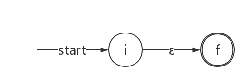
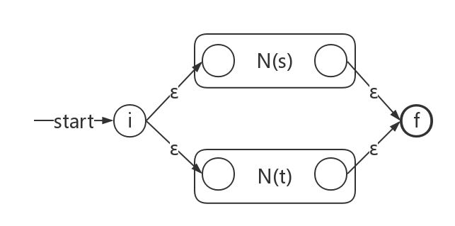
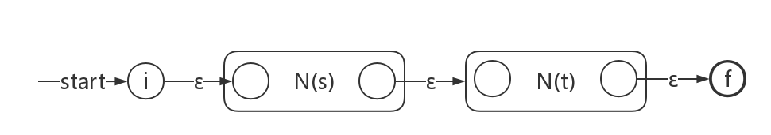
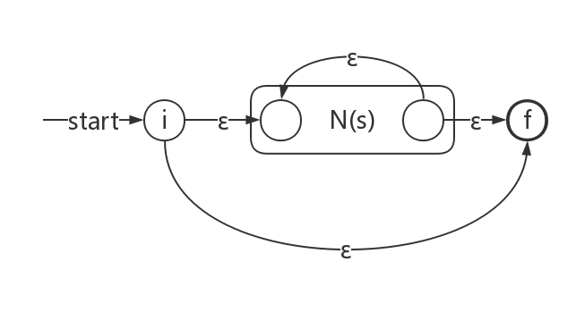
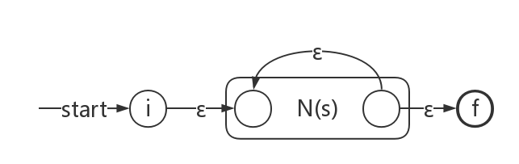
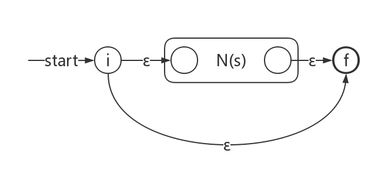
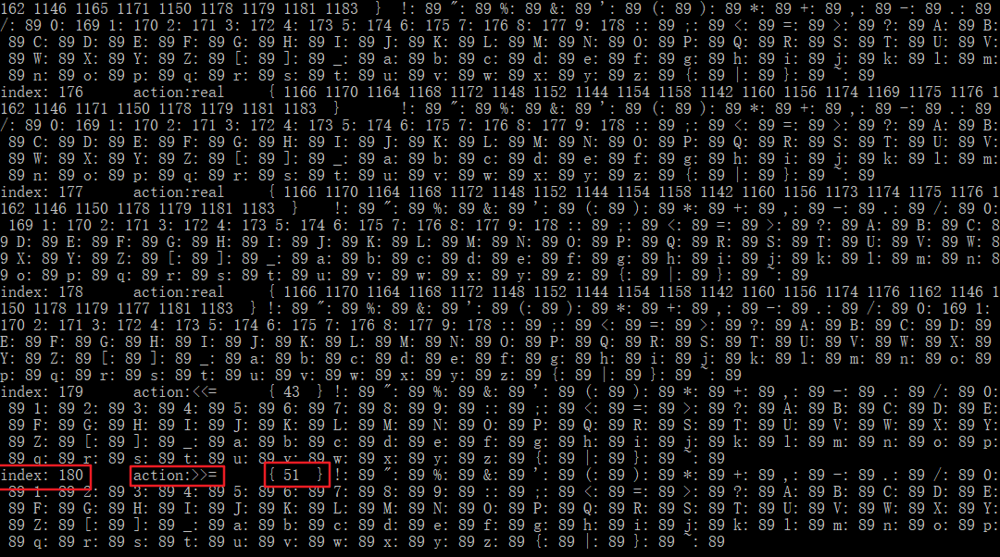
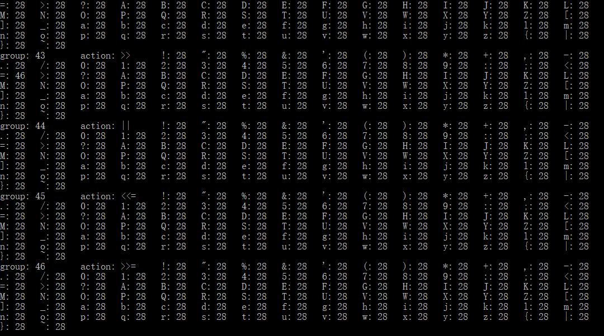
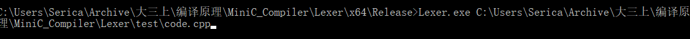
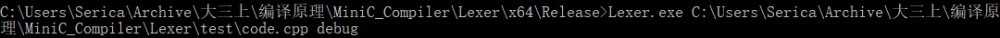

# 编译原理—词法分析器实验报告

<h3>09016414 罗崟洪</h3>

## 实验目的

根据编译原理课程知识，编写一个词法分析器，以此深入理解词法分析的规则。

## 实验内容

1. 选择一个你熟悉的程序设计语言，找到它的规范（referrence or standard）。在规范中找到其词法的BNF或正规式描述。

2. 选择该语言的一个子集（能够构成一个mini的语言，该语言至少能够进行函数调用、控制流语句（分支或循环）、简单的运算和赋值操作。）给出该mini语言的词法的正规文法或正规式。

3. 将该正规文法或正规式转换为NFA。给出转换过程。

4. 将上述NFA转换为DFA，并最小化。给出具体过程。

5. 根据最小化后的DFA写出词法分析程序。将该词法分析程序打印出来。

6. 用mini语言写出若干个小程序作为测试用例。用上述词法分析程序对这些小程序进行词法分析，并将测试用例和分析结果打印出来。

## 实验假设

1. 识别语言的正则表达式描述

选用C语言的子集作为词法分析器所识别的语言，参考C99标准，并为了方便起见对词法进行了重新整理。词法的正则表达式可以用lex语言描述如下：

```c++
/* operators */
// 赋值运算符
"=" {return(=)}
"+=" {return(+=)}
"-=" {return(-=)}
"*=" {return(*=)}
"/=" {return(/=)}
"%=" {return(%=)}
"<<=" {return(<<=)}
">>=" {return(>>=)}
// 算数运算符
"+" {return(+)}
"-" {return(-)}
"*" {return(*)}
"/" {return(/)}
"%" {return(%)}
"<<" {return(<<)}
">>" {return(>>)}
// 单目运算符
"++" {return(++)}
"--" {return(--)}
"~" {return(~)}
// 位运算符
"&" {return(&)}
"|" {return(|)}
// 逻辑运算符
"&&" {return(&&)}
"||" {return(||)}
"!" {return(!)}
// 关系运算符
"==" {return(eq)}
"<" {return(lt)}
">" {return(gt)}
"<=" {return(lte)}
">=" {return(gte)}
/* 标点符号、界符 */
":" {return(:)}
"?" {return(?)}
"." {return(.)}
"," {return(,)}
";" {return(;)}
"\"" {return("\"")}
"'" {return("'")}
"{" {return(LP)}
"}" {return(RP)}
"(" {return(SLP)}
")" {return(SRP)}
"[" {return(SLB)}
"]" {return(SRB)}
/* 标识符 */
"[_a-zA-Z][_a-zA-Z0-9]*" {return(id)}
/* 常量 */
"[0-9]+" {return(integer)}
"[0-9]+(.[0-9]+)?" {return(real)}
```

2. 关键字约定

除了以上正则表达式外，C99标准中还规定了一些关键字。我们使用符号表来保存这些关键字，词法分析中，遇到标识符后，词法分析器会先查找该标识符是否存在于符号表的关键字集合中，以此判断其是用户定义的标识符或是保留字。

支持的关键字如下：

```c++
// type specifier
int char bool void 
// storage class specifier
typedef static
// type qualifier
const
// statements
if else switch case default for 
do while break continue return
// others
struct enum class public private 
this new delete friend true false
```

## 逐步建立有穷自动机

由于我们对于实验假设的语言具有一定的规模，不难想象一开始构建的NFA状态数会相当庞大（事实也是如此，只要想想26个字母、10个数字和其他标点符号就能大概估算其状态数），以至于难以用手算的方式进行建立和化简。考虑到下学期的课程设计中要实现lex，本着发挥动手能力，践行“实验精神”的初衷，我们决定使用算法来完成有穷自动机的逐步建立。

**因此，在下文中，我们会给出建立和化简中得到的状态转换表，但不会给出图形化的状态转换图（因为状态数量过于庞大）。当然，我们会对具体实现思路进行详细说明。**

### 正则表达式的预处理

输入的正则表达式往往是人容易理解的形式，但对于程序而言，要处理这些表达式还需要经过一些步骤。

#### 支持扩展的语法

在实验假设中，我们用到了扩展的正则表达式语法，形如`[0-9]`，这表示0到9间的任意字符。为了简化后续程序的复杂度，我们可以把它转化为未经扩展的等价形式。这一轮处理后的效果如下所示。

```c++
相关代码见 Regex.cpp 中 void Regex::preprocess()函数
输入：.[_a-cA-C]
输出：.(_|a|b|c|A|B|C)
```

#### 增加显式的连接符号

实际上，连接运算也是正则表达式中运算的一种，但它常常容易被忽视，这将导致之后在建立NFA时遇到问题。为了避免这种情况，我们需要对正则表达式显式增加连接符号。

这一轮处理后的效果如下所示，我们规定`#`表示连接操作。

```c++
相关代码见 Regex.cpp 中 void Regex::preprocess()函数
输入：ab*c|(d|ef)+
输出：a#b*#c|(d|e#f)+
```

#### 中缀正则表达式转后缀正则表达式

为了让程序构造NFA时简单一些，需要把中缀表达式转换为后缀表达式，这样我们可以对表达式的优先级不加区分。

算法思想如下：

```c++
// Regex.cpp
/**
| 操作符     | (    | #    | \|   | )    |
| ---------- | ---- | ---- | ---- | ---- |
| 栈外优先级 | 6    | 4    | 2    | 1    |
| 栈内优先级 | 1    | 5    | 3    | 6    |
*/
string Regex::to_postfix()
{
	/* pattern只有一个字符，则直接返回 */
	if (pattern.size() == 1) {
		postfix = pattern;
		return postfix;
	}

	/* 预处理，仅执行一次 */
	preprocess();

	stack<char> op; // 操作符栈
	op.push('$'); // 哨兵
	pattern += '$'; // 哨兵

	for (int i = 0, n = pattern.size(); i < n && !op.empty();) {
		char current = pattern[i];
		/* 转义字符处理 */
		if (current == '\\') {
			if (i + 1 < n && RegexOperator::includes(pattern[i + 1])) {
				postfix += '\\';
				postfix += pattern[i + 1];
				i += 2;
			}
		}
		/* 操作符处理 */
		else if (RegexOperator::includes(current)) {
			/* 单目运算符，直接输出 */
			if (RegexOperator::typeof(current) == 1) {
				postfix += current;
				i++;
				continue;
			}
			/* 双目运算符，根据栈内栈外优先级执行算法 */
			char top = op.top();
			if (RegexOperator::in_comming_priority(current) > RegexOperator::in_stack_priority(top)) {
				op.push(current);
				i++;
			} 
			else if (RegexOperator::in_comming_priority(current) < RegexOperator::in_stack_priority(top)) {
				postfix += top;
				op.pop();
			}
			else if (RegexOperator::in_comming_priority(current) == RegexOperator::in_stack_priority(top)) {
				op.pop();
				if (top == '(') 
					i++;
			}
		}
		/* 操作数直接输出 */
		else {
			postfix += current;
			i++;
		}
	}
	
	return postfix;
}
```

这属于数据结构中的知识，在这里不加以展开。

### 由正则表达式集合建立NFA

#### 正则表达式转NFA

我们可以使用`McNaughton-Yamada-Thompson`算法从正则表达式构造NFA，而注意到实验假设中我们对正则表达式进行了扩展（加入了`?`和`+`运算符），因此延续该算法的思想，构造过程如下：

对于字母表中的表达式a，构造如下的NFA：


对于表达式ε，构造如下的NFA：



下面开始递推地构造NFA。假设正则表达式s和t的NFA分别为N(s)和N(t)，则新的NFA可那如下方法构造：

1. r=s|t

   

2. r=st

   

3. r=s*

   

4. r=s+

   

5. r=s?

   

6. r=(s)

   这种情况不需要构建新的NFA。

根据上述思想，我们可以根据单个正则表达式建立NFA。相关代码可以见`NFA.cpp`中的`void NFA::create_from_regex(const string & postfix_pattern, const string & action)`函数。注意，由于之后建立状态转换表的时候还需要用到终结符集合以及接收状态的行为`action`，因此这个函数还负责记录该NFA的字母表（即终结符集）以及NFA所识别的语言`action`。

#### 正则表达式集合转NFA

我们可以对每个正则表达式建立一个NFA，最终用一个新的开始节点连接这些NFA的开始节点，并把它们的终结节点连接到新的终结节点，得到一个完整的NFA。相关代码见`NFA.cpp`中的`void NFA::create_from_regexes(const string & postfix_pattern, const string & action)`函数。

### NFA转DFA

我们可以根据子集构造法来构造DFA，该算法在龙书上有详细介绍，这里对算法本身不做过多讨论，而讨论其实现方法。由于这属于优化阶段，因此算法定义在`Optimizer`类中。

要实现这个算法，需要实现几个重要的函数（具体代码见`Optimizer.cpp`）：

1. `move(T, a)`：返回能够从T中某状态s出发，通过标号为a的转换到达的NFA状态的集合。该算法通过对状态机的广度优先搜索实现。注意到接下来求ε闭包时，返回的集合仅仅比`move(T, ε)`多了集合T中的元素，因此我们可以直接在这里实现ε闭包，根据传入参数`a`的值判断返回的集合中是否要加上集合T中的元素。

   ```c++
   // Optimizer.cpp
   set<FANode*> Optimizer::move(set<FANode*> & T, int a)
   {
   	set<FANode*> a_closure_T;
   	
   	stack<FANode*> stack;
   	if (T.size() == 0) {
   		// 空集访问任何元素也都是空集
   		return  a_closure_T;
   	}
   	for (set<FANode*>::iterator it = T.begin(); it != T.end(); it++) {
   		stack.push(*it);
   		if (a == FANode::EPSILON)
   			a_closure_T.insert(*it);
   	}
   
   	while (!stack.empty()) {
   		FANode* t = stack.top();
   		stack.pop();
   		vector<pair<int, FANode*>>* t_trans = t->get_transition_table();
   
   		for (auto u : *t_trans) {
   			if (u.first == a && a_closure_T.find(u.second) == a_closure_T.end()) {
   				a_closure_T.insert(u.second);
   				stack.push(u.second);
   			}
   		}
   	}
   	return a_closure_T;
   }
   ```

2. `epsilon_closure(T)`：返回能够从T中某NFA状态s开始只通过ε转换到达的NFA状态集合。这里我们直接用`move`函数实现。

   ```c++
   // Optimizer.cpp
   set<FANode*> Optimizer::epsilon_closure(set<FANode*> & T)
   {
   	return move(T, FANode::EPSILON);
   }
   ```

3. `epsilon_closure(s)`：返回通过状态s开始只通过ε转换到达的NFA状态集合。注意这个函数只会在算法的第一步用到，因此没必要额外实现。我们可以向`epsilon_closure(T)`函数传入一个只包含初始状态的状态集合即可达到我们的目的。

实现了上述操作后，我们可以实现子集构造法。与书中不同的是，我们在实现时并不真的需要对在状态转换表中完成记录的状态进行标记，原因是因为新加入的状态总被加入了DFA状态集合列表`d_states`的末端，而迭代在索引到达列表尾部结束，这意味着当没有新状态产生后，由于`d_states`的大小不再增加，因此下标到达末尾相当于对所有状态都进行过标记了。为了减少数据维度，我们使用`d_actions`队列来记录相应下标状态的行为。对于开始状态，给其一个特殊的行为`start`作为标记。

```c++
// Optimizer.cpp
void Optimizer::build_dfa(NFA & nfa)
{
	FANode * s0 = nfa.get_start_node();
	set<FANode *> t;
	t.insert(s0);
	set<FANode*> t_closure = epsilon_closure(t);
	d_states.push_back(t_closure);
	d_actions.push_back("start");
	alphabet = nfa.get_alphabet();
	for (int i = 0; i < d_states.size(); i++) {
		for (int a : alphabet) {
			set<FANode*> a_closure = move(d_states[i], a);
			set<FANode*> u = epsilon_closure(a_closure);
			int u_index = get_index(u);
			if (u_index == -1) {
				d_states.push_back(u);
				d_actions.push_back(get_action(u));
				u_index = get_index(u);
			}
			d_trans[pair<int, int>(i, a)] = u_index;
		}
	}	
}
```

### 最小化DFA

使用划分的方法对DFA状态进行最小化，该算法有三个阶段：

1. 初始化分组，和书中实现有些区别的是，我们把最初的分组划分为：

   - 非接受状态
   - 不同的接受状态（即采取不同`action`，或者说识别不同正则表达式的状态）
   - 死状态

   注意到我们在构造DFA的时候可能出现了死状态（**我们标记死状态的`action`为`phai`**），这是容易理解的。死状态并不影响我们之后的操作，并且维护了算法操作的统一性，因此不需要清理。当然，死状态的出现会使得最终的状态转换表是稠密的，因为非法的输入最终都将指向死状态，这对于空间利用上可能不太友好。如果出现了死状态，有且仅有一个，具体地，死状态是一个空集（size为0的set），由于使用了`map`，因此算法会认为所有的空集都是一样的，执行时不会有多个不同的空集出现在DFA的状态集合中。

2. 迭代并产生最终的划分，这也将产生最小DFA的状态转换表

3. 确定每个状态的action

篇幅有限，具体代码可见`Optimizer.cpp`中的`void Optimizer::minimize_dfa()`函数。

## 模拟最小DFA的执行

虽然最小DFA也是状态机，可以用图的数据结构进行模拟，但对于状态较多的DFA，构建图的过程是比较耗时耗力的，而且状态之间除了要转移，还要考虑可能的“退回上一状态操作”。实际上，在之前执行算法后得到的最小DFA状态转换表以及各个状态对应的action就已经足以描述一个DFA，根据状态转换表写出转移函数`move`即可实现状态转移。

```c++
// DFA.cpp
int DFA::move(int state, int step)
{
	if (trans.count(pair<int, int>(state, step)) == 1)
		return trans[pair<int, int>(state, step)];
	return -1;
}
```

在实现`move`函数后，就可以模拟DFA的执行。执行中要考虑对空白字符的过滤，同时要考虑报错信息。因此在处理程序代码时，还要记录当前的行号、行内偏移等信息，以便进行报错。

此外，根据书上的思想，要实现最长匹配的原则，例如不能识别到`bool`就返回保留字`bool`，因为这可能是一个名为`boolean`的`identifier`。因此设置两个索引，`lexeme_begin`和`peek_forward`，前者记录词素起始位置，后者则一直向前“偷窥”，直到遇到了最长匹配的词素，程序进行返回。

### 出错的情况

1. 输出完前一个token后，进行下一轮处理时，发现DFA的开始状态对于读头输入无法走通。
2. 已经读到程序结尾，但状态是非接收状态。

### 符号表维护

实际上，符号表是词法分析器和语法分析去共同维护的。在当前版本中，符号表暂时作为词法分析器的内部成员，且功能并不完全，仅仅是表达一下动机。

在执行中，我们如果识别了id，那么对于这个id，我们先查询其是否已经出现在符号表中。如果是，说明这个id是保留字，输出的token将其类型说明为该保留字，而非用户定义的id。

当然，对于真正的符号表，还需要记录id的更多信息，并且对于用户定义的id也要在符号表中进行记录，当前的词法分析器里没有完成这一功能。

此外，虽然可以对保留字也设置相关正则表达式，以使得DFA可以和识别其他模式一样识别这些保留字，但这会增加许多额外状态，大幅降低DFA的构建过程，而且违背建立符号表的思想。经过实验，如果我们把这些保留字作为正则规则加入DFA，那么实验假设的语言的最小DFA需要花一分多钟，而是用符号表可以把时间降到30秒左右。

对于符号表的建立过程，我们放在了DFA的构造函数中。下面的代码片段中`scan`函数给出了DFA模拟的过程，篇幅有限，部分代码以`//...`形式省略。完整代码见`DFA.cpp`。

```c++
// DFA.cpp
DFA::DFA(map<pair<int, int>, int> trans, vector<string> actions)
{
	// ...
	/* keywords */
	// type specifier
	symbol_table.push_back("int");
	symbol_table.push_back("char");
	symbol_table.push_back("bool");
	// ...
	// storage class specifier
	symbol_table.push_back("typedef");
	symbol_table.push_back("static");
	// type qualifier
	symbol_table.push_back("const");
	// statements
	symbol_table.push_back("if");
	symbol_table.push_back("else");
	symbol_table.push_back("switch");
	symbol_table.push_back("case");
	// ...
}

void DFA::scan(const string & code)
{
	// ...
	while (true) {
		// 遇到空白符
		while (遇到空白符) {
			if (code[peek_forward] == '\n') {
				// 换行符，行号加一，行内偏移量归零
				cnt_line++;
				cnt_offset = 0;
			}
			else {
				// 碰到空格或tab
				cnt_offset++;
			}
			peek_forward++;
		}
		// 到达源代码末尾
		if (peek_forward >= N)
			return;
		cnt_offset++; // 找到了一个词素起始点，行内字符序号加1，记录
		lexeme_begin = peek_forward; 		
		int cur_state = start_state;
		// 最长匹配原则
		do {
			cur_state = move(cur_state, (int)code[peek_forward]);
			if (cur_state == -1) {
				// 错误处理
			}
			peek_forward++;
			cnt_offset++;
		} while (peek_forward < N && actions[cur_state] == "");
		// 读到程序结尾，但是状态是非接受状态
		if (cur_state != -1 && actions[cur_state] == "") {
			// 错误处理
		}
		// 从该接受状态开始，继续走过连续的接收状态，直至走到一个非终结状态或达到死状态phai
		if (cur_state != -1 && actions[cur_state] != "") {
			// 用mark来标记最后到达的接收状态（最长匹配）
			int mark = cur_state;
			while (peek_forward < N) {
				cur_state = move(cur_state, (int)code[peek_forward]);
				if (是非终结状态或达到死状态phai)
					break;
				mark = cur_state;
				cnt_offset++;
				peek_forward++;
			}
			// 处理符号表
			string attribute = actions[mark];
			string value = code.substr(lexeme_begin, peek_forward - lexeme_begin);
			if (attribute == "id") {
				if (在符号表里出现) {
					// id识别为保留字
					continue;
				}
			}
			// 输出token
		}
	}
}
```

## 测试

### 输入样例

接下来我们对程序进行测试，假定输入的样例程序如下所示。这个程序没有具体意义，但尽量覆盖了实验假定语言中可能出现的情况。

```c++
// code.cpp
class Helper {
private:
    Helper();
    ~Helper();
public:
    static struct tool {
        enum color {
            RED,
            BLUE,
            GREEN
        };
        enum sex {
            MALE,
            FEMALE
        };
    } tool;
    static bool greater_or_equal_than(int a, int b) {
        if((a >= b) && ((a > b) || (a == b))) 
            return true;
        return false;
    }
};


int main() { 
    typedef double myDouble;
    myDouble myNum = 10.5;
    char c = 'a';
    const int hisNum = (int) c;
    int herNum = myNum - hisNum;
    bool flag = true;
    do {
        myNum %= 22;
    } while (!flag);
    for(int i = 0; i < 100; i++) {
        if(herNum == myNum) {
            break;
        }
        else if(Helper::greater_or_equal_than(herNum, myNum)) {
            herNum--;
            continue;
        }
        else {
            herNum++;
            continue;
        }
        myNum = (myNum != hisNum ? ++myNum : --myNum);
    }
    switch(herNum) {
        case 10:
            herNum *= myNum;
            break;
        case 20:
            herNum = Helper::tool.RED;
        default:
            herNum -= myNum;
    }
    return 0;
}
```

### 输出结果

词法分析器给出的输出结果如下，由此可以验证其执行的正确性：

```c++
< 0     class   class >
< 1     id      Helper >
< 2     LP      { >
< 3     private private >
< 4     :       : >
< 5     id      Helper >
< 6     SLP     ( >
< 7     SRP     ) >
< 8     ;       ; >
< 9     ~       ~ >
< 10    id      Helper >
< 11    SLP     ( >
< 12    SRP     ) >
< 13    ;       ; >
< 14    public  public >
< 15    :       : >
< 16    static  static >
< 17    struct  struct >
< 18    id      tool >
< 19    LP      { >
< 20    enum    enum >
< 21    id      color >
< 22    LP      { >
< 23    id      RED >
< 24    ,       , >
< 25    id      BLUE >
< 26    ,       , >
< 27    id      GREEN >
< 28    RP      } >
< 29    ;       ; >
< 30    enum    enum >
< 31    id      sex >
< 32    LP      { >
< 33    id      MALE >
< 34    ,       , >
< 35    id      FEMALE >
< 36    RP      } >
< 37    ;       ; >
< 38    RP      } >
< 39    id      tool >
< 40    ;       ; >
< 41    static  static >
< 42    bool    bool >
< 43    id      greater_or_equal_than >
< 44    SLP     ( >
< 45    int     int >
< 46    id      a >
< 47    ,       , >
< 48    int     int >
< 49    id      b >
< 50    SRP     ) >
< 51    LP      { >
< 52    if      if >
< 53    SLP     ( >
< 54    SLP     ( >
< 55    id      a >
< 56    gte     >= >
< 57    id      b >
< 58    SRP     ) >
< 59    &&      && >
< 60    SLP     ( >
< 61    SLP     ( >
< 62    id      a >
< 63    gt      > >
< 64    id      b >
< 65    SRP     ) >
< 66    ||      || >
< 67    SLP     ( >
< 68    id      a >
< 69    eq      == >
< 70    id      b >
< 71    SRP     ) >
< 72    SRP     ) >
< 73    SRP     ) >
< 74    return  return >
< 75    true    true >
< 76    ;       ; >
< 77    return  return >
< 78    false   false >
< 79    ;       ; >
< 80    RP      } >
< 81    RP      } >
< 82    ;       ; >
< 83    int     int >
< 84    id      main >
< 85    SLP     ( >
< 86    SRP     ) >
< 87    LP      { >
< 88    typedef typedef >
< 89    id      double >
< 90    id      myDouble >
< 91    ;       ; >
< 92    id      myDouble >
< 93    id      myNum >
< 94    =       = >
< 95    real    10.5 >
< 96    ;       ; >
< 97    char    char >
< 98    id      c >
< 99    =       = >
< 100   '       ' >
< 101   id      a >
< 102   '       ' >
< 103   ;       ; >
< 104   const   const >
< 105   int     int >
< 106   id      hisNum >
< 107   =       = >
< 108   SLP     ( >
< 109   int     int >
< 110   SRP     ) >
< 111   id      c >
< 112   ;       ; >
< 113   int     int >
< 114   id      herNum >
< 115   =       = >
< 116   id      myNum >
< 117   -       - >
< 118   id      hisNum >
< 119   ;       ; >
< 120   bool    bool >
< 121   id      flag >
< 122   =       = >
< 123   true    true >
< 124   ;       ; >
< 125   do      do >
< 126   LP      { >
< 127   id      myNum >
< 128   %=      %= >
< 129   integer 22 >
< 130   ;       ; >
< 131   RP      } >
< 132   while   while >
< 133   SLP     ( >
< 134   !       ! >
< 135   id      flag >
< 136   SRP     ) >
< 137   ;       ; >
< 138   for     for >
< 139   SLP     ( >
< 140   int     int >
< 141   id      i >
< 142   =       = >
< 143   integer 0 >
< 144   ;       ; >
< 145   id      i >
< 146   lt      < >
< 147   integer 100 >
< 148   ;       ; >
< 149   id      i >
< 150   ++      ++ >
< 151   SRP     ) >
< 152   LP      { >
< 153   if      if >
< 154   SLP     ( >
< 155   id      herNum >
< 156   eq      == >
< 157   id      myNum >
< 158   SRP     ) >
< 159   LP      { >
< 160   break   break >
< 161   ;       ; >
< 162   RP      } >
< 163   else    else >
< 164   if      if >
< 165   SLP     ( >
< 166   id      Helper >
< 167   :       : >
< 168   :       : >
< 169   id      greater_or_equal_than >
< 170   SLP     ( >
< 171   id      herNum >
< 172   ,       , >
< 173   id      myNum >
< 174   SRP     ) >
< 175   SRP     ) >
< 176   LP      { >
< 177   id      herNum >
< 178   --      -- >
< 179   ;       ; >
< 180   continue        continue >
< 181   ;       ; >
< 182   RP      } >
< 183   else    else >
< 184   LP      { >
< 185   id      herNum >
< 186   ++      ++ >
< 187   ;       ; >
< 188   continue        continue >
< 189   ;       ; >
< 190   RP      } >
< 191   id      myNum >
< 192   =       = >
< 193   SLP     ( >
< 194   id      myNum >
< 195   ne      != >
< 196   id      hisNum >
< 197   ?       ? >
< 198   ++      ++ >
< 199   id      myNum >
< 200   :       : >
< 201   --      -- >
< 202   id      myNum >
< 203   SRP     ) >
< 204   ;       ; >
< 205   RP      } >
< 206   switch  switch >
< 207   SLP     ( >
< 208   id      herNum >
< 209   SRP     ) >
< 210   LP      { >
< 211   case    case >
< 212   integer 10 >
< 213   :       : >
< 214   id      herNum >
< 215   *=      *= >
< 216   id      myNum >
< 217   ;       ; >
< 218   break   break >
< 219   ;       ; >
< 220   case    case >
< 221   integer 20 >
< 222   :       : >
< 223   id      herNum >
< 224   =       = >
< 225   id      Helper >
< 226   :       : >
< 227   :       : >
< 228   id      tool >
< 229   .       . >
< 230   id      RED >
< 231   ;       ; >
< 232   default default >
< 233   :       : >
< 234   id      herNum >
< 235   -=      -= >
< 236   id      myNum >
< 237   ;       ; >
< 238   RP      } >
< 239   return  return >
< 240   integer 0 >
< 241   ;       ; >
< 242   RP      } >
```

### 调试信息

我们设置了一些辅助函数，用于打印构建过程中的信息，如状态转换表。

下图是DFA的状态转换表，这个DFA有180个状态。`index`为状态编号，`action`为状态的行为（如180号状态接受串`>>=`），而后面的集合表示与其对应的NFA中的状态集合。下图中可以发现根据算法转换正则表达式得到的NFA的状态数量高达1000多个！集合之后的“字母表-状态号”对表示了状态转换的行为。可以发现很多输入都将转换到89状态，这是一个死状态，表明非法的输入。



类似地，我们可以打印最小DFA的状态转换表。最小DFA只有46个状态，状态数被大大减少。**然而，这一结论已经证明了一开始我们的假设，即如果手动构建NFA，然后再转为最小DFA，这个过程对人而言是相当困难甚至无法实现的。因此，我们不给出最终DFA的图结构形式的图示，仅仅给出其状态转换表，请谅解。**



### 状态转换表

状态转换表较大，可以在附录中查看。

## 如何执行我们的Lexer程序

我们的程序不难直接双击`Lexer.exe`运行，这是一个控制台程序，需要打开`cmd`传入参数后才可执行。我们在`Lexer.exe`所在目录下打开`cmd`，之后按如下规则输入指令，其中debug是可选项：

```bash
Lexer.exe <path-to-code> [debug]
```

例如：



第一个参数为要进行词法分析的程序源码路径，由于时间有限，我们还没有将文件系统的更多操作考虑在内，因此请输入绝对路径（可以直接把代码文件拖到`cmd`中，`cmd`会生成该文件的绝对路径）。同样，程序的词法分析结果不会写入到文件里，而仅仅是打印在控制台上。程序执行时会先在控制台上打印要进行词法分析的源代码，随后会打印DFA建立时各个步骤花费的时间。**在我们的电脑上耗费时间如下，可见NFA转DFA的过程耗时最多，原因是显然的。**因为根据之前的结果，NFA的状态**高达上千个**，而要把它们转换为只有一百多个状态的DFA，是十分费力的。

```bash
Building Min DFA now... It can take minutes, please be patient and wait...
...Regular expressions loaded, start to build NFA from them.
...NFA already built, takes 0.001s, now start to build DFA from the NFA.
...DFA already built, takes 38.201s, now start to minimize the DFA.
...Min DFA already built, takes 0.001s, ready to do lexical analysis.
```

### 打印调试信息

在路径之后增加参数`debug`即可。



## Future Work以及软件工程相关思想

### Future Work（会体现在下学期的课程设计中）

1. 完善文件系统，即输入输出到文件
2. 状态表也将以文件形式存储，这样只需要生成一次状态转换表，以后使用时只需要读入状态转换表即可，无须重复生成。
3. 尝试优化性能（目前的瓶颈在于NFA状态过多，导致生成DFA时过慢）
4. 增强鲁棒性和报错能力
5. 引入更多数据结构，完善代码结构组织（如目前的action应该用枚举类而不是字符串表示，又如token是否应该进行封装等）
6. 将符号表抽离出词法分析器中。符号表应该是词法分析器和语法分析器共同维护的。

### 软件工程思想

词法分析的过程是经过一系列步骤的，各个步骤间要实现松耦合，而单个步骤内的实现应该是高内聚的。我们在写代码时为各个类编写了测试文件，在源代码中以`Test`开头，如`TestRegex.cpp`、`TestNFA.cpp`等等。在进行下一步开发时，总是要保证代码可以通过这些测试。由于时间有限，程序的架构并不是十分合理有序，且暂时没有绘制类图，之后会花时间重构。

对于具体实现部分，我们使用了一些数据结构，如转换表使用`map<pair<int, int>, int> trans`这一形式，里面的`pair<int, int>`表示采取的一个`step`，前一个表示当前状态号，后一个表示读入的符号，而`int`则是这一步骤将转换到的状态。因此如果状态1有一条值为`a`的边指向状态2，那么有`trans[pair<int, int>(1, 'a')] = 2`。

在构建时，我们还要单独构建各个状态的行为，体现在`vector<string> actions`中，建立的顺序是有序的，所以和状态号是一一对应的。当然，我们做了许多思考和工作保证`actions`里的下标和状态号一一对应，为了使得以后开发方便，我们可以把这些都绑在一起，使得今后不需要考虑顺序信息。

## 附录：最小DFA的状态转换表

group: 0        action: start   !: 1    ": 2    %: 3    &: 4    ': 5    (: 6    ): 7    *: 8    +: 9    ,: 10   -: 11
.: 12   /: 13   0: 14   1: 14   2: 14   3: 14   4: 14   5: 14   6: 14   7: 14   8: 14   9: 14   :: 15   ;: 16   <: 17
=: 18   >: 19   ?: 20   A: 21   B: 21   C: 21   D: 21   E: 21   F: 21   G: 21   H: 21   I: 21   J: 21   K: 21   L: 21
M: 21   N: 21   O: 21   P: 21   Q: 21   R: 21   S: 21   T: 21   U: 21   V: 21   W: 21   X: 21   Y: 21   Z: 21   [: 22
]: 23   _: 21   a: 21   b: 21   c: 21   d: 21   e: 21   f: 21   g: 21   h: 21   i: 21   j: 21   k: 21   l: 21   m: 21
n: 21   o: 21   p: 21   q: 21   r: 21   s: 21   t: 21   u: 21   v: 21   w: 21   x: 21   y: 21   z: 21   {: 24   |: 25
}: 26   ~: 27

\n: 1        action: !       !: 28   ": 28   %: 28   &: 28   ': 28   (: 28   ): 28   *: 28   +: 28   ,: 28   -: 28
.: 28   /: 28   0: 28   1: 28   2: 28   3: 28   4: 28   5: 28   6: 28   7: 28   8: 28   9: 28   :: 28   ;: 28   <: 28
=: 29   >: 28   ?: 28   A: 28   B: 28   C: 28   D: 28   E: 28   F: 28   G: 28   H: 28   I: 28   J: 28   K: 28   L: 28
M: 28   N: 28   O: 28   P: 28   Q: 28   R: 28   S: 28   T: 28   U: 28   V: 28   W: 28   X: 28   Y: 28   Z: 28   [: 28
]: 28   _: 28   a: 28   b: 28   c: 28   d: 28   e: 28   f: 28   g: 28   h: 28   i: 28   j: 28   k: 28   l: 28   m: 28
n: 28   o: 28   p: 28   q: 28   r: 28   s: 28   t: 28   u: 28   v: 28   w: 28   x: 28   y: 28   z: 28   {: 28   |: 28
}: 28   ~: 28

group: 2        action: "       !: 28   ": 28   %: 28   &: 28   ': 28   (: 28   ): 28   *: 28   +: 28   ,: 28   -: 28
.: 28   /: 28   0: 28   1: 28   2: 28   3: 28   4: 28   5: 28   6: 28   7: 28   8: 28   9: 28   :: 28   ;: 28   <: 28
=: 28   >: 28   ?: 28   A: 28   B: 28   C: 28   D: 28   E: 28   F: 28   G: 28   H: 28   I: 28   J: 28   K: 28   L: 28
M: 28   N: 28   O: 28   P: 28   Q: 28   R: 28   S: 28   T: 28   U: 28   V: 28   W: 28   X: 28   Y: 28   Z: 28   [: 28
]: 28   _: 28   a: 28   b: 28   c: 28   d: 28   e: 28   f: 28   g: 28   h: 28   i: 28   j: 28   k: 28   l: 28   m: 28
n: 28   o: 28   p: 28   q: 28   r: 28   s: 28   t: 28   u: 28   v: 28   w: 28   x: 28   y: 28   z: 28   {: 28   |: 28
}: 28   ~: 28

group: 3        action: %       !: 28   ": 28   %: 28   &: 28   ': 28   (: 28   ): 28   *: 28   +: 28   ,: 28   -: 28
.: 28   /: 28   0: 28   1: 28   2: 28   3: 28   4: 28   5: 28   6: 28   7: 28   8: 28   9: 28   :: 28   ;: 28   <: 28
=: 30   >: 28   ?: 28   A: 28   B: 28   C: 28   D: 28   E: 28   F: 28   G: 28   H: 28   I: 28   J: 28   K: 28   L: 28
M: 28   N: 28   O: 28   P: 28   Q: 28   R: 28   S: 28   T: 28   U: 28   V: 28   W: 28   X: 28   Y: 28   Z: 28   [: 28
]: 28   _: 28   a: 28   b: 28   c: 28   d: 28   e: 28   f: 28   g: 28   h: 28   i: 28   j: 28   k: 28   l: 28   m: 28
n: 28   o: 28   p: 28   q: 28   r: 28   s: 28   t: 28   u: 28   v: 28   w: 28   x: 28   y: 28   z: 28   {: 28   |: 28
}: 28   ~: 28

group: 4        action: &       !: 28   ": 28   %: 28   &: 31   ': 28   (: 28   ): 28   *: 28   +: 28   ,: 28   -: 28
.: 28   /: 28   0: 28   1: 28   2: 28   3: 28   4: 28   5: 28   6: 28   7: 28   8: 28   9: 28   :: 28   ;: 28   <: 28
=: 28   >: 28   ?: 28   A: 28   B: 28   C: 28   D: 28   E: 28   F: 28   G: 28   H: 28   I: 28   J: 28   K: 28   L: 28
M: 28   N: 28   O: 28   P: 28   Q: 28   R: 28   S: 28   T: 28   U: 28   V: 28   W: 28   X: 28   Y: 28   Z: 28   [: 28
]: 28   _: 28   a: 28   b: 28   c: 28   d: 28   e: 28   f: 28   g: 28   h: 28   i: 28   j: 28   k: 28   l: 28   m: 28
n: 28   o: 28   p: 28   q: 28   r: 28   s: 28   t: 28   u: 28   v: 28   w: 28   x: 28   y: 28   z: 28   {: 28   |: 28
}: 28   ~: 28

group: 5        action: '       !: 28   ": 28   %: 28   &: 28   ': 28   (: 28   ): 28   *: 28   +: 28   ,: 28   -: 28
.: 28   /: 28   0: 28   1: 28   2: 28   3: 28   4: 28   5: 28   6: 28   7: 28   8: 28   9: 28   :: 28   ;: 28   <: 28
=: 28   >: 28   ?: 28   A: 28   B: 28   C: 28   D: 28   E: 28   F: 28   G: 28   H: 28   I: 28   J: 28   K: 28   L: 28
M: 28   N: 28   O: 28   P: 28   Q: 28   R: 28   S: 28   T: 28   U: 28   V: 28   W: 28   X: 28   Y: 28   Z: 28   [: 28
]: 28   _: 28   a: 28   b: 28   c: 28   d: 28   e: 28   f: 28   g: 28   h: 28   i: 28   j: 28   k: 28   l: 28   m: 28
n: 28   o: 28   p: 28   q: 28   r: 28   s: 28   t: 28   u: 28   v: 28   w: 28   x: 28   y: 28   z: 28   {: 28   |: 28
}: 28   ~: 28

group: 6        action: SLP     !: 28   ": 28   %: 28   &: 28   ': 28   (: 28   ): 28   *: 28   +: 28   ,: 28   -: 28
.: 28   /: 28   0: 28   1: 28   2: 28   3: 28   4: 28   5: 28   6: 28   7: 28   8: 28   9: 28   :: 28   ;: 28   <: 28
=: 28   >: 28   ?: 28   A: 28   B: 28   C: 28   D: 28   E: 28   F: 28   G: 28   H: 28   I: 28   J: 28   K: 28   L: 28
M: 28   N: 28   O: 28   P: 28   Q: 28   R: 28   S: 28   T: 28   U: 28   V: 28   W: 28   X: 28   Y: 28   Z: 28   [: 28
]: 28   _: 28   a: 28   b: 28   c: 28   d: 28   e: 28   f: 28   g: 28   h: 28   i: 28   j: 28   k: 28   l: 28   m: 28
n: 28   o: 28   p: 28   q: 28   r: 28   s: 28   t: 28   u: 28   v: 28   w: 28   x: 28   y: 28   z: 28   {: 28   |: 28
}: 28   ~: 28

group: 7        action: SRP     !: 28   ": 28   %: 28   &: 28   ': 28   (: 28   ): 28   *: 28   +: 28   ,: 28   -: 28
.: 28   /: 28   0: 28   1: 28   2: 28   3: 28   4: 28   5: 28   6: 28   7: 28   8: 28   9: 28   :: 28   ;: 28   <: 28
=: 28   >: 28   ?: 28   A: 28   B: 28   C: 28   D: 28   E: 28   F: 28   G: 28   H: 28   I: 28   J: 28   K: 28   L: 28
M: 28   N: 28   O: 28   P: 28   Q: 28   R: 28   S: 28   T: 28   U: 28   V: 28   W: 28   X: 28   Y: 28   Z: 28   [: 28
]: 28   _: 28   a: 28   b: 28   c: 28   d: 28   e: 28   f: 28   g: 28   h: 28   i: 28   j: 28   k: 28   l: 28   m: 28
n: 28   o: 28   p: 28   q: 28   r: 28   s: 28   t: 28   u: 28   v: 28   w: 28   x: 28   y: 28   z: 28   {: 28   |: 28
}: 28   ~: 28

group: 8        action: *       !: 28   ": 28   %: 28   &: 28   ': 28   (: 28   ): 28   *: 28   +: 28   ,: 28   -: 28
.: 28   /: 28   0: 28   1: 28   2: 28   3: 28   4: 28   5: 28   6: 28   7: 28   8: 28   9: 28   :: 28   ;: 28   <: 28
=: 32   >: 28   ?: 28   A: 28   B: 28   C: 28   D: 28   E: 28   F: 28   G: 28   H: 28   I: 28   J: 28   K: 28   L: 28
M: 28   N: 28   O: 28   P: 28   Q: 28   R: 28   S: 28   T: 28   U: 28   V: 28   W: 28   X: 28   Y: 28   Z: 28   [: 28
]: 28   _: 28   a: 28   b: 28   c: 28   d: 28   e: 28   f: 28   g: 28   h: 28   i: 28   j: 28   k: 28   l: 28   m: 28
n: 28   o: 28   p: 28   q: 28   r: 28   s: 28   t: 28   u: 28   v: 28   w: 28   x: 28   y: 28   z: 28   {: 28   |: 28
}: 28   ~: 28

group: 9        action: +       !: 28   ": 28   %: 28   &: 28   ': 28   (: 28   ): 28   *: 28   +: 33   ,: 28   -: 28
.: 28   /: 28   0: 28   1: 28   2: 28   3: 28   4: 28   5: 28   6: 28   7: 28   8: 28   9: 28   :: 28   ;: 28   <: 28
=: 34   >: 28   ?: 28   A: 28   B: 28   C: 28   D: 28   E: 28   F: 28   G: 28   H: 28   I: 28   J: 28   K: 28   L: 28
M: 28   N: 28   O: 28   P: 28   Q: 28   R: 28   S: 28   T: 28   U: 28   V: 28   W: 28   X: 28   Y: 28   Z: 28   [: 28
]: 28   _: 28   a: 28   b: 28   c: 28   d: 28   e: 28   f: 28   g: 28   h: 28   i: 28   j: 28   k: 28   l: 28   m: 28
n: 28   o: 28   p: 28   q: 28   r: 28   s: 28   t: 28   u: 28   v: 28   w: 28   x: 28   y: 28   z: 28   {: 28   |: 28
}: 28   ~: 28

group: 10       action: ,       !: 28   ": 28   %: 28   &: 28   ': 28   (: 28   ): 28   *: 28   +: 28   ,: 28   -: 28
.: 28   /: 28   0: 28   1: 28   2: 28   3: 28   4: 28   5: 28   6: 28   7: 28   8: 28   9: 28   :: 28   ;: 28   <: 28
=: 28   >: 28   ?: 28   A: 28   B: 28   C: 28   D: 28   E: 28   F: 28   G: 28   H: 28   I: 28   J: 28   K: 28   L: 28
M: 28   N: 28   O: 28   P: 28   Q: 28   R: 28   S: 28   T: 28   U: 28   V: 28   W: 28   X: 28   Y: 28   Z: 28   [: 28
]: 28   _: 28   a: 28   b: 28   c: 28   d: 28   e: 28   f: 28   g: 28   h: 28   i: 28   j: 28   k: 28   l: 28   m: 28
n: 28   o: 28   p: 28   q: 28   r: 28   s: 28   t: 28   u: 28   v: 28   w: 28   x: 28   y: 28   z: 28   {: 28   |: 28
}: 28   ~: 28

group: 11       action: -       !: 28   ": 28   %: 28   &: 28   ': 28   (: 28   ): 28   *: 28   +: 28   ,: 28   -: 35
.: 28   /: 28   0: 28   1: 28   2: 28   3: 28   4: 28   5: 28   6: 28   7: 28   8: 28   9: 28   :: 28   ;: 28   <: 28
=: 36   >: 28   ?: 28   A: 28   B: 28   C: 28   D: 28   E: 28   F: 28   G: 28   H: 28   I: 28   J: 28   K: 28   L: 28
M: 28   N: 28   O: 28   P: 28   Q: 28   R: 28   S: 28   T: 28   U: 28   V: 28   W: 28   X: 28   Y: 28   Z: 28   [: 28
]: 28   _: 28   a: 28   b: 28   c: 28   d: 28   e: 28   f: 28   g: 28   h: 28   i: 28   j: 28   k: 28   l: 28   m: 28
n: 28   o: 28   p: 28   q: 28   r: 28   s: 28   t: 28   u: 28   v: 28   w: 28   x: 28   y: 28   z: 28   {: 28   |: 28
}: 28   ~: 28

group: 12       action: .       !: 28   ": 28   %: 28   &: 28   ': 28   (: 28   ): 28   *: 28   +: 28   ,: 28   -: 28
.: 28   /: 28   0: 28   1: 28   2: 28   3: 28   4: 28   5: 28   6: 28   7: 28   8: 28   9: 28   :: 28   ;: 28   <: 28
=: 28   >: 28   ?: 28   A: 28   B: 28   C: 28   D: 28   E: 28   F: 28   G: 28   H: 28   I: 28   J: 28   K: 28   L: 28
M: 28   N: 28   O: 28   P: 28   Q: 28   R: 28   S: 28   T: 28   U: 28   V: 28   W: 28   X: 28   Y: 28   Z: 28   [: 28
]: 28   _: 28   a: 28   b: 28   c: 28   d: 28   e: 28   f: 28   g: 28   h: 28   i: 28   j: 28   k: 28   l: 28   m: 28
n: 28   o: 28   p: 28   q: 28   r: 28   s: 28   t: 28   u: 28   v: 28   w: 28   x: 28   y: 28   z: 28   {: 28   |: 28
}: 28   ~: 28

group: 13       action: /       !: 28   ": 28   %: 28   &: 28   ': 28   (: 28   ): 28   *: 28   +: 28   ,: 28   -: 28
.: 28   /: 28   0: 28   1: 28   2: 28   3: 28   4: 28   5: 28   6: 28   7: 28   8: 28   9: 28   :: 28   ;: 28   <: 28
=: 37   >: 28   ?: 28   A: 28   B: 28   C: 28   D: 28   E: 28   F: 28   G: 28   H: 28   I: 28   J: 28   K: 28   L: 28
M: 28   N: 28   O: 28   P: 28   Q: 28   R: 28   S: 28   T: 28   U: 28   V: 28   W: 28   X: 28   Y: 28   Z: 28   [: 28
]: 28   _: 28   a: 28   b: 28   c: 28   d: 28   e: 28   f: 28   g: 28   h: 28   i: 28   j: 28   k: 28   l: 28   m: 28
n: 28   o: 28   p: 28   q: 28   r: 28   s: 28   t: 28   u: 28   v: 28   w: 28   x: 28   y: 28   z: 28   {: 28   |: 28
}: 28   ~: 28

group: 14       action: integer !: 28   ": 28   %: 28   &: 28   ': 28   (: 28   ): 28   *: 28   +: 28   ,: 28   -: 28
.: 38   /: 28   0: 14   1: 14   2: 14   3: 14   4: 14   5: 14   6: 14   7: 14   8: 14   9: 14   :: 28   ;: 28   <: 28
=: 28   >: 28   ?: 28   A: 28   B: 28   C: 28   D: 28   E: 28   F: 28   G: 28   H: 28   I: 28   J: 28   K: 28   L: 28
M: 28   N: 28   O: 28   P: 28   Q: 28   R: 28   S: 28   T: 28   U: 28   V: 28   W: 28   X: 28   Y: 28   Z: 28   [: 28
]: 28   _: 28   a: 28   b: 28   c: 28   d: 28   e: 28   f: 28   g: 28   h: 28   i: 28   j: 28   k: 28   l: 28   m: 28
n: 28   o: 28   p: 28   q: 28   r: 28   s: 28   t: 28   u: 28   v: 28   w: 28   x: 28   y: 28   z: 28   {: 28   |: 28
}: 28   ~: 28

group: 15       action: :       !: 28   ": 28   %: 28   &: 28   ': 28   (: 28   ): 28   *: 28   +: 28   ,: 28   -: 28
.: 28   /: 28   0: 28   1: 28   2: 28   3: 28   4: 28   5: 28   6: 28   7: 28   8: 28   9: 28   :: 28   ;: 28   <: 28
=: 28   >: 28   ?: 28   A: 28   B: 28   C: 28   D: 28   E: 28   F: 28   G: 28   H: 28   I: 28   J: 28   K: 28   L: 28
M: 28   N: 28   O: 28   P: 28   Q: 28   R: 28   S: 28   T: 28   U: 28   V: 28   W: 28   X: 28   Y: 28   Z: 28   [: 28
]: 28   _: 28   a: 28   b: 28   c: 28   d: 28   e: 28   f: 28   g: 28   h: 28   i: 28   j: 28   k: 28   l: 28   m: 28
n: 28   o: 28   p: 28   q: 28   r: 28   s: 28   t: 28   u: 28   v: 28   w: 28   x: 28   y: 28   z: 28   {: 28   |: 28
}: 28   ~: 28

group: 16       action: ;       !: 28   ": 28   %: 28   &: 28   ': 28   (: 28   ): 28   *: 28   +: 28   ,: 28   -: 28
.: 28   /: 28   0: 28   1: 28   2: 28   3: 28   4: 28   5: 28   6: 28   7: 28   8: 28   9: 28   :: 28   ;: 28   <: 28
=: 28   >: 28   ?: 28   A: 28   B: 28   C: 28   D: 28   E: 28   F: 28   G: 28   H: 28   I: 28   J: 28   K: 28   L: 28
M: 28   N: 28   O: 28   P: 28   Q: 28   R: 28   S: 28   T: 28   U: 28   V: 28   W: 28   X: 28   Y: 28   Z: 28   [: 28
]: 28   _: 28   a: 28   b: 28   c: 28   d: 28   e: 28   f: 28   g: 28   h: 28   i: 28   j: 28   k: 28   l: 28   m: 28
n: 28   o: 28   p: 28   q: 28   r: 28   s: 28   t: 28   u: 28   v: 28   w: 28   x: 28   y: 28   z: 28   {: 28   |: 28
}: 28   ~: 28

group: 17       action: lt      !: 28   ": 28   %: 28   &: 28   ': 28   (: 28   ): 28   *: 28   +: 28   ,: 28   -: 28
.: 28   /: 28   0: 28   1: 28   2: 28   3: 28   4: 28   5: 28   6: 28   7: 28   8: 28   9: 28   :: 28   ;: 28   <: 39
=: 40   >: 28   ?: 28   A: 28   B: 28   C: 28   D: 28   E: 28   F: 28   G: 28   H: 28   I: 28   J: 28   K: 28   L: 28
M: 28   N: 28   O: 28   P: 28   Q: 28   R: 28   S: 28   T: 28   U: 28   V: 28   W: 28   X: 28   Y: 28   Z: 28   [: 28
]: 28   _: 28   a: 28   b: 28   c: 28   d: 28   e: 28   f: 28   g: 28   h: 28   i: 28   j: 28   k: 28   l: 28   m: 28
n: 28   o: 28   p: 28   q: 28   r: 28   s: 28   t: 28   u: 28   v: 28   w: 28   x: 28   y: 28   z: 28   {: 28   |: 28
}: 28   ~: 28

group: 18       action: =       !: 28   ": 28   %: 28   &: 28   ': 28   (: 28   ): 28   *: 28   +: 28   ,: 28   -: 28
.: 28   /: 28   0: 28   1: 28   2: 28   3: 28   4: 28   5: 28   6: 28   7: 28   8: 28   9: 28   :: 28   ;: 28   <: 28
=: 41   >: 28   ?: 28   A: 28   B: 28   C: 28   D: 28   E: 28   F: 28   G: 28   H: 28   I: 28   J: 28   K: 28   L: 28
M: 28   N: 28   O: 28   P: 28   Q: 28   R: 28   S: 28   T: 28   U: 28   V: 28   W: 28   X: 28   Y: 28   Z: 28   [: 28
]: 28   _: 28   a: 28   b: 28   c: 28   d: 28   e: 28   f: 28   g: 28   h: 28   i: 28   j: 28   k: 28   l: 28   m: 28
n: 28   o: 28   p: 28   q: 28   r: 28   s: 28   t: 28   u: 28   v: 28   w: 28   x: 28   y: 28   z: 28   {: 28   |: 28
}: 28   ~: 28

group: 19       action: gt      !: 28   ": 28   %: 28   &: 28   ': 28   (: 28   ): 28   *: 28   +: 28   ,: 28   -: 28
.: 28   /: 28   0: 28   1: 28   2: 28   3: 28   4: 28   5: 28   6: 28   7: 28   8: 28   9: 28   :: 28   ;: 28   <: 28
=: 42   >: 43   ?: 28   A: 28   B: 28   C: 28   D: 28   E: 28   F: 28   G: 28   H: 28   I: 28   J: 28   K: 28   L: 28
M: 28   N: 28   O: 28   P: 28   Q: 28   R: 28   S: 28   T: 28   U: 28   V: 28   W: 28   X: 28   Y: 28   Z: 28   [: 28
]: 28   _: 28   a: 28   b: 28   c: 28   d: 28   e: 28   f: 28   g: 28   h: 28   i: 28   j: 28   k: 28   l: 28   m: 28
n: 28   o: 28   p: 28   q: 28   r: 28   s: 28   t: 28   u: 28   v: 28   w: 28   x: 28   y: 28   z: 28   {: 28   |: 28
}: 28   ~: 28

group: 20       action: ?       !: 28   ": 28   %: 28   &: 28   ': 28   (: 28   ): 28   *: 28   +: 28   ,: 28   -: 28
.: 28   /: 28   0: 28   1: 28   2: 28   3: 28   4: 28   5: 28   6: 28   7: 28   8: 28   9: 28   :: 28   ;: 28   <: 28
=: 28   >: 28   ?: 28   A: 28   B: 28   C: 28   D: 28   E: 28   F: 28   G: 28   H: 28   I: 28   J: 28   K: 28   L: 28
M: 28   N: 28   O: 28   P: 28   Q: 28   R: 28   S: 28   T: 28   U: 28   V: 28   W: 28   X: 28   Y: 28   Z: 28   [: 28
]: 28   _: 28   a: 28   b: 28   c: 28   d: 28   e: 28   f: 28   g: 28   h: 28   i: 28   j: 28   k: 28   l: 28   m: 28
n: 28   o: 28   p: 28   q: 28   r: 28   s: 28   t: 28   u: 28   v: 28   w: 28   x: 28   y: 28   z: 28   {: 28   |: 28
}: 28   ~: 28

group: 21       action: id      !: 28   ": 28   %: 28   &: 28   ': 28   (: 28   ): 28   *: 28   +: 28   ,: 28   -: 28
.: 28   /: 28   0: 21   1: 21   2: 21   3: 21   4: 21   5: 21   6: 21   7: 21   8: 21   9: 21   :: 28   ;: 28   <: 28
=: 28   >: 28   ?: 28   A: 21   B: 21   C: 21   D: 21   E: 21   F: 21   G: 21   H: 21   I: 21   J: 21   K: 21   L: 21
M: 21   N: 21   O: 21   P: 21   Q: 21   R: 21   S: 21   T: 21   U: 21   V: 21   W: 21   X: 21   Y: 21   Z: 21   [: 28
]: 28   _: 21   a: 21   b: 21   c: 21   d: 21   e: 21   f: 21   g: 21   h: 21   i: 21   j: 21   k: 21   l: 21   m: 21
n: 21   o: 21   p: 21   q: 21   r: 21   s: 21   t: 21   u: 21   v: 21   w: 21   x: 21   y: 21   z: 21   {: 28   |: 28
}: 28   ~: 28

group: 22       action: SLB     !: 28   ": 28   %: 28   &: 28   ': 28   (: 28   ): 28   *: 28   +: 28   ,: 28   -: 28
.: 28   /: 28   0: 28   1: 28   2: 28   3: 28   4: 28   5: 28   6: 28   7: 28   8: 28   9: 28   :: 28   ;: 28   <: 28
=: 28   >: 28   ?: 28   A: 28   B: 28   C: 28   D: 28   E: 28   F: 28   G: 28   H: 28   I: 28   J: 28   K: 28   L: 28
M: 28   N: 28   O: 28   P: 28   Q: 28   R: 28   S: 28   T: 28   U: 28   V: 28   W: 28   X: 28   Y: 28   Z: 28   [: 28
]: 28   _: 28   a: 28   b: 28   c: 28   d: 28   e: 28   f: 28   g: 28   h: 28   i: 28   j: 28   k: 28   l: 28   m: 28
n: 28   o: 28   p: 28   q: 28   r: 28   s: 28   t: 28   u: 28   v: 28   w: 28   x: 28   y: 28   z: 28   {: 28   |: 28
}: 28   ~: 28

group: 23       action: SRB     !: 28   ": 28   %: 28   &: 28   ': 28   (: 28   ): 28   *: 28   +: 28   ,: 28   -: 28
.: 28   /: 28   0: 28   1: 28   2: 28   3: 28   4: 28   5: 28   6: 28   7: 28   8: 28   9: 28   :: 28   ;: 28   <: 28
=: 28   >: 28   ?: 28   A: 28   B: 28   C: 28   D: 28   E: 28   F: 28   G: 28   H: 28   I: 28   J: 28   K: 28   L: 28
M: 28   N: 28   O: 28   P: 28   Q: 28   R: 28   S: 28   T: 28   U: 28   V: 28   W: 28   X: 28   Y: 28   Z: 28   [: 28
]: 28   _: 28   a: 28   b: 28   c: 28   d: 28   e: 28   f: 28   g: 28   h: 28   i: 28   j: 28   k: 28   l: 28   m: 28
n: 28   o: 28   p: 28   q: 28   r: 28   s: 28   t: 28   u: 28   v: 28   w: 28   x: 28   y: 28   z: 28   {: 28   |: 28
}: 28   ~: 28

group: 24       action: LP      !: 28   ": 28   %: 28   &: 28   ': 28   (: 28   ): 28   *: 28   +: 28   ,: 28   -: 28
.: 28   /: 28   0: 28   1: 28   2: 28   3: 28   4: 28   5: 28   6: 28   7: 28   8: 28   9: 28   :: 28   ;: 28   <: 28
=: 28   >: 28   ?: 28   A: 28   B: 28   C: 28   D: 28   E: 28   F: 28   G: 28   H: 28   I: 28   J: 28   K: 28   L: 28
M: 28   N: 28   O: 28   P: 28   Q: 28   R: 28   S: 28   T: 28   U: 28   V: 28   W: 28   X: 28   Y: 28   Z: 28   [: 28
]: 28   _: 28   a: 28   b: 28   c: 28   d: 28   e: 28   f: 28   g: 28   h: 28   i: 28   j: 28   k: 28   l: 28   m: 28
n: 28   o: 28   p: 28   q: 28   r: 28   s: 28   t: 28   u: 28   v: 28   w: 28   x: 28   y: 28   z: 28   {: 28   |: 28
}: 28   ~: 28

group: 25       action: |       !: 28   ": 28   %: 28   &: 28   ': 28   (: 28   ): 28   *: 28   +: 28   ,: 28   -: 28
.: 28   /: 28   0: 28   1: 28   2: 28   3: 28   4: 28   5: 28   6: 28   7: 28   8: 28   9: 28   :: 28   ;: 28   <: 28
=: 28   >: 28   ?: 28   A: 28   B: 28   C: 28   D: 28   E: 28   F: 28   G: 28   H: 28   I: 28   J: 28   K: 28   L: 28
M: 28   N: 28   O: 28   P: 28   Q: 28   R: 28   S: 28   T: 28   U: 28   V: 28   W: 28   X: 28   Y: 28   Z: 28   [: 28
]: 28   _: 28   a: 28   b: 28   c: 28   d: 28   e: 28   f: 28   g: 28   h: 28   i: 28   j: 28   k: 28   l: 28   m: 28
n: 28   o: 28   p: 28   q: 28   r: 28   s: 28   t: 28   u: 28   v: 28   w: 28   x: 28   y: 28   z: 28   {: 28   |: 44
}: 28   ~: 28

group: 26       action: RP      !: 28   ": 28   %: 28   &: 28   ': 28   (: 28   ): 28   *: 28   +: 28   ,: 28   -: 28
.: 28   /: 28   0: 28   1: 28   2: 28   3: 28   4: 28   5: 28   6: 28   7: 28   8: 28   9: 28   :: 28   ;: 28   <: 28
=: 28   >: 28   ?: 28   A: 28   B: 28   C: 28   D: 28   E: 28   F: 28   G: 28   H: 28   I: 28   J: 28   K: 28   L: 28
M: 28   N: 28   O: 28   P: 28   Q: 28   R: 28   S: 28   T: 28   U: 28   V: 28   W: 28   X: 28   Y: 28   Z: 28   [: 28
]: 28   _: 28   a: 28   b: 28   c: 28   d: 28   e: 28   f: 28   g: 28   h: 28   i: 28   j: 28   k: 28   l: 28   m: 28
n: 28   o: 28   p: 28   q: 28   r: 28   s: 28   t: 28   u: 28   v: 28   w: 28   x: 28   y: 28   z: 28   {: 28   |: 28
}: 28   ~: 28

group: 27       action: ~       !: 28   ": 28   %: 28   &: 28   ': 28   (: 28   ): 28   *: 28   +: 28   ,: 28   -: 28
.: 28   /: 28   0: 28   1: 28   2: 28   3: 28   4: 28   5: 28   6: 28   7: 28   8: 28   9: 28   :: 28   ;: 28   <: 28
=: 28   >: 28   ?: 28   A: 28   B: 28   C: 28   D: 28   E: 28   F: 28   G: 28   H: 28   I: 28   J: 28   K: 28   L: 28
M: 28   N: 28   O: 28   P: 28   Q: 28   R: 28   S: 28   T: 28   U: 28   V: 28   W: 28   X: 28   Y: 28   Z: 28   [: 28
]: 28   _: 28   a: 28   b: 28   c: 28   d: 28   e: 28   f: 28   g: 28   h: 28   i: 28   j: 28   k: 28   l: 28   m: 28
n: 28   o: 28   p: 28   q: 28   r: 28   s: 28   t: 28   u: 28   v: 28   w: 28   x: 28   y: 28   z: 28   {: 28   |: 28
}: 28   ~: 28

group: 28       action: phai    !: 28   ": 28   %: 28   &: 28   ': 28   (: 28   ): 28   *: 28   +: 28   ,: 28   -: 28
.: 28   /: 28   0: 28   1: 28   2: 28   3: 28   4: 28   5: 28   6: 28   7: 28   8: 28   9: 28   :: 28   ;: 28   <: 28
=: 28   >: 28   ?: 28   A: 28   B: 28   C: 28   D: 28   E: 28   F: 28   G: 28   H: 28   I: 28   J: 28   K: 28   L: 28
M: 28   N: 28   O: 28   P: 28   Q: 28   R: 28   S: 28   T: 28   U: 28   V: 28   W: 28   X: 28   Y: 28   Z: 28   [: 28
]: 28   _: 28   a: 28   b: 28   c: 28   d: 28   e: 28   f: 28   g: 28   h: 28   i: 28   j: 28   k: 28   l: 28   m: 28
n: 28   o: 28   p: 28   q: 28   r: 28   s: 28   t: 28   u: 28   v: 28   w: 28   x: 28   y: 28   z: 28   {: 28   |: 28
}: 28   ~: 28

group: 29       action: ne      !: 28   ": 28   %: 28   &: 28   ': 28   (: 28   ): 28   *: 28   +: 28   ,: 28   -: 28
.: 28   /: 28   0: 28   1: 28   2: 28   3: 28   4: 28   5: 28   6: 28   7: 28   8: 28   9: 28   :: 28   ;: 28   <: 28
=: 28   >: 28   ?: 28   A: 28   B: 28   C: 28   D: 28   E: 28   F: 28   G: 28   H: 28   I: 28   J: 28   K: 28   L: 28
M: 28   N: 28   O: 28   P: 28   Q: 28   R: 28   S: 28   T: 28   U: 28   V: 28   W: 28   X: 28   Y: 28   Z: 28   [: 28
]: 28   _: 28   a: 28   b: 28   c: 28   d: 28   e: 28   f: 28   g: 28   h: 28   i: 28   j: 28   k: 28   l: 28   m: 28
n: 28   o: 28   p: 28   q: 28   r: 28   s: 28   t: 28   u: 28   v: 28   w: 28   x: 28   y: 28   z: 28   {: 28   |: 28
}: 28   ~: 28

group: 30       action: %=      !: 28   ": 28   %: 28   &: 28   ': 28   (: 28   ): 28   *: 28   +: 28   ,: 28   -: 28
.: 28   /: 28   0: 28   1: 28   2: 28   3: 28   4: 28   5: 28   6: 28   7: 28   8: 28   9: 28   :: 28   ;: 28   <: 28
=: 28   >: 28   ?: 28   A: 28   B: 28   C: 28   D: 28   E: 28   F: 28   G: 28   H: 28   I: 28   J: 28   K: 28   L: 28
M: 28   N: 28   O: 28   P: 28   Q: 28   R: 28   S: 28   T: 28   U: 28   V: 28   W: 28   X: 28   Y: 28   Z: 28   [: 28
]: 28   _: 28   a: 28   b: 28   c: 28   d: 28   e: 28   f: 28   g: 28   h: 28   i: 28   j: 28   k: 28   l: 28   m: 28
n: 28   o: 28   p: 28   q: 28   r: 28   s: 28   t: 28   u: 28   v: 28   w: 28   x: 28   y: 28   z: 28   {: 28   |: 28
}: 28   ~: 28

group: 31       action: &&      !: 28   ": 28   %: 28   &: 28   ': 28   (: 28   ): 28   *: 28   +: 28   ,: 28   -: 28
.: 28   /: 28   0: 28   1: 28   2: 28   3: 28   4: 28   5: 28   6: 28   7: 28   8: 28   9: 28   :: 28   ;: 28   <: 28
=: 28   >: 28   ?: 28   A: 28   B: 28   C: 28   D: 28   E: 28   F: 28   G: 28   H: 28   I: 28   J: 28   K: 28   L: 28
M: 28   N: 28   O: 28   P: 28   Q: 28   R: 28   S: 28   T: 28   U: 28   V: 28   W: 28   X: 28   Y: 28   Z: 28   [: 28
]: 28   _: 28   a: 28   b: 28   c: 28   d: 28   e: 28   f: 28   g: 28   h: 28   i: 28   j: 28   k: 28   l: 28   m: 28
n: 28   o: 28   p: 28   q: 28   r: 28   s: 28   t: 28   u: 28   v: 28   w: 28   x: 28   y: 28   z: 28   {: 28   |: 28
}: 28   ~: 28

group: 32       action: *=      !: 28   ": 28   %: 28   &: 28   ': 28   (: 28   ): 28   *: 28   +: 28   ,: 28   -: 28
.: 28   /: 28   0: 28   1: 28   2: 28   3: 28   4: 28   5: 28   6: 28   7: 28   8: 28   9: 28   :: 28   ;: 28   <: 28
=: 28   >: 28   ?: 28   A: 28   B: 28   C: 28   D: 28   E: 28   F: 28   G: 28   H: 28   I: 28   J: 28   K: 28   L: 28
M: 28   N: 28   O: 28   P: 28   Q: 28   R: 28   S: 28   T: 28   U: 28   V: 28   W: 28   X: 28   Y: 28   Z: 28   [: 28
]: 28   _: 28   a: 28   b: 28   c: 28   d: 28   e: 28   f: 28   g: 28   h: 28   i: 28   j: 28   k: 28   l: 28   m: 28
n: 28   o: 28   p: 28   q: 28   r: 28   s: 28   t: 28   u: 28   v: 28   w: 28   x: 28   y: 28   z: 28   {: 28   |: 28
}: 28   ~: 28

group: 33       action: ++      !: 28   ": 28   %: 28   &: 28   ': 28   (: 28   ): 28   *: 28   +: 28   ,: 28   -: 28
.: 28   /: 28   0: 28   1: 28   2: 28   3: 28   4: 28   5: 28   6: 28   7: 28   8: 28   9: 28   :: 28   ;: 28   <: 28
=: 28   >: 28   ?: 28   A: 28   B: 28   C: 28   D: 28   E: 28   F: 28   G: 28   H: 28   I: 28   J: 28   K: 28   L: 28
M: 28   N: 28   O: 28   P: 28   Q: 28   R: 28   S: 28   T: 28   U: 28   V: 28   W: 28   X: 28   Y: 28   Z: 28   [: 28
]: 28   _: 28   a: 28   b: 28   c: 28   d: 28   e: 28   f: 28   g: 28   h: 28   i: 28   j: 28   k: 28   l: 28   m: 28
n: 28   o: 28   p: 28   q: 28   r: 28   s: 28   t: 28   u: 28   v: 28   w: 28   x: 28   y: 28   z: 28   {: 28   |: 28
}: 28   ~: 28

group: 34       action: +=      !: 28   ": 28   %: 28   &: 28   ': 28   (: 28   ): 28   *: 28   +: 28   ,: 28   -: 28
.: 28   /: 28   0: 28   1: 28   2: 28   3: 28   4: 28   5: 28   6: 28   7: 28   8: 28   9: 28   :: 28   ;: 28   <: 28
=: 28   >: 28   ?: 28   A: 28   B: 28   C: 28   D: 28   E: 28   F: 28   G: 28   H: 28   I: 28   J: 28   K: 28   L: 28
M: 28   N: 28   O: 28   P: 28   Q: 28   R: 28   S: 28   T: 28   U: 28   V: 28   W: 28   X: 28   Y: 28   Z: 28   [: 28
]: 28   _: 28   a: 28   b: 28   c: 28   d: 28   e: 28   f: 28   g: 28   h: 28   i: 28   j: 28   k: 28   l: 28   m: 28
n: 28   o: 28   p: 28   q: 28   r: 28   s: 28   t: 28   u: 28   v: 28   w: 28   x: 28   y: 28   z: 28   {: 28   |: 28
}: 28   ~: 28

group: 35       action: --      !: 28   ": 28   %: 28   &: 28   ': 28   (: 28   ): 28   *: 28   +: 28   ,: 28   -: 28
.: 28   /: 28   0: 28   1: 28   2: 28   3: 28   4: 28   5: 28   6: 28   7: 28   8: 28   9: 28   :: 28   ;: 28   <: 28
=: 28   >: 28   ?: 28   A: 28   B: 28   C: 28   D: 28   E: 28   F: 28   G: 28   H: 28   I: 28   J: 28   K: 28   L: 28
M: 28   N: 28   O: 28   P: 28   Q: 28   R: 28   S: 28   T: 28   U: 28   V: 28   W: 28   X: 28   Y: 28   Z: 28   [: 28
]: 28   _: 28   a: 28   b: 28   c: 28   d: 28   e: 28   f: 28   g: 28   h: 28   i: 28   j: 28   k: 28   l: 28   m: 28
n: 28   o: 28   p: 28   q: 28   r: 28   s: 28   t: 28   u: 28   v: 28   w: 28   x: 28   y: 28   z: 28   {: 28   |: 28
}: 28   ~: 28

group: 36       action: -=      !: 28   ": 28   %: 28   &: 28   ': 28   (: 28   ): 28   *: 28   +: 28   ,: 28   -: 28
.: 28   /: 28   0: 28   1: 28   2: 28   3: 28   4: 28   5: 28   6: 28   7: 28   8: 28   9: 28   :: 28   ;: 28   <: 28
=: 28   >: 28   ?: 28   A: 28   B: 28   C: 28   D: 28   E: 28   F: 28   G: 28   H: 28   I: 28   J: 28   K: 28   L: 28
M: 28   N: 28   O: 28   P: 28   Q: 28   R: 28   S: 28   T: 28   U: 28   V: 28   W: 28   X: 28   Y: 28   Z: 28   [: 28
]: 28   _: 28   a: 28   b: 28   c: 28   d: 28   e: 28   f: 28   g: 28   h: 28   i: 28   j: 28   k: 28   l: 28   m: 28
n: 28   o: 28   p: 28   q: 28   r: 28   s: 28   t: 28   u: 28   v: 28   w: 28   x: 28   y: 28   z: 28   {: 28   |: 28
}: 28   ~: 28

group: 37       action: /=      !: 28   ": 28   %: 28   &: 28   ': 28   (: 28   ): 28   *: 28   +: 28   ,: 28   -: 28
.: 28   /: 28   0: 28   1: 28   2: 28   3: 28   4: 28   5: 28   6: 28   7: 28   8: 28   9: 28   :: 28   ;: 28   <: 28
=: 28   >: 28   ?: 28   A: 28   B: 28   C: 28   D: 28   E: 28   F: 28   G: 28   H: 28   I: 28   J: 28   K: 28   L: 28
M: 28   N: 28   O: 28   P: 28   Q: 28   R: 28   S: 28   T: 28   U: 28   V: 28   W: 28   X: 28   Y: 28   Z: 28   [: 28
]: 28   _: 28   a: 28   b: 28   c: 28   d: 28   e: 28   f: 28   g: 28   h: 28   i: 28   j: 28   k: 28   l: 28   m: 28
n: 28   o: 28   p: 28   q: 28   r: 28   s: 28   t: 28   u: 28   v: 28   w: 28   x: 28   y: 28   z: 28   {: 28   |: 28
}: 28   ~: 28

group: 38       action: real    !: 28   ": 28   %: 28   &: 28   ': 28   (: 28   ): 28   *: 28   +: 28   ,: 28   -: 28
.: 28   /: 28   0: 38   1: 38   2: 38   3: 38   4: 38   5: 38   6: 38   7: 38   8: 38   9: 38   :: 28   ;: 28   <: 28
=: 28   >: 28   ?: 28   A: 28   B: 28   C: 28   D: 28   E: 28   F: 28   G: 28   H: 28   I: 28   J: 28   K: 28   L: 28
M: 28   N: 28   O: 28   P: 28   Q: 28   R: 28   S: 28   T: 28   U: 28   V: 28   W: 28   X: 28   Y: 28   Z: 28   [: 28
]: 28   _: 28   a: 28   b: 28   c: 28   d: 28   e: 28   f: 28   g: 28   h: 28   i: 28   j: 28   k: 28   l: 28   m: 28
n: 28   o: 28   p: 28   q: 28   r: 28   s: 28   t: 28   u: 28   v: 28   w: 28   x: 28   y: 28   z: 28   {: 28   |: 28
}: 28   ~: 28

group: 39       action: <<      !: 28   ": 28   %: 28   &: 28   ': 28   (: 28   ): 28   *: 28   +: 28   ,: 28   -: 28
.: 28   /: 28   0: 28   1: 28   2: 28   3: 28   4: 28   5: 28   6: 28   7: 28   8: 28   9: 28   :: 28   ;: 28   <: 28
=: 45   >: 28   ?: 28   A: 28   B: 28   C: 28   D: 28   E: 28   F: 28   G: 28   H: 28   I: 28   J: 28   K: 28   L: 28
M: 28   N: 28   O: 28   P: 28   Q: 28   R: 28   S: 28   T: 28   U: 28   V: 28   W: 28   X: 28   Y: 28   Z: 28   [: 28
]: 28   _: 28   a: 28   b: 28   c: 28   d: 28   e: 28   f: 28   g: 28   h: 28   i: 28   j: 28   k: 28   l: 28   m: 28
n: 28   o: 28   p: 28   q: 28   r: 28   s: 28   t: 28   u: 28   v: 28   w: 28   x: 28   y: 28   z: 28   {: 28   |: 28
}: 28   ~: 28

group: 40       action: lte     !: 28   ": 28   %: 28   &: 28   ': 28   (: 28   ): 28   *: 28   +: 28   ,: 28   -: 28
.: 28   /: 28   0: 28   1: 28   2: 28   3: 28   4: 28   5: 28   6: 28   7: 28   8: 28   9: 28   :: 28   ;: 28   <: 28
=: 28   >: 28   ?: 28   A: 28   B: 28   C: 28   D: 28   E: 28   F: 28   G: 28   H: 28   I: 28   J: 28   K: 28   L: 28
M: 28   N: 28   O: 28   P: 28   Q: 28   R: 28   S: 28   T: 28   U: 28   V: 28   W: 28   X: 28   Y: 28   Z: 28   [: 28
]: 28   _: 28   a: 28   b: 28   c: 28   d: 28   e: 28   f: 28   g: 28   h: 28   i: 28   j: 28   k: 28   l: 28   m: 28
n: 28   o: 28   p: 28   q: 28   r: 28   s: 28   t: 28   u: 28   v: 28   w: 28   x: 28   y: 28   z: 28   {: 28   |: 28
}: 28   ~: 28

group: 41       action: eq      !: 28   ": 28   %: 28   &: 28   ': 28   (: 28   ): 28   *: 28   +: 28   ,: 28   -: 28
.: 28   /: 28   0: 28   1: 28   2: 28   3: 28   4: 28   5: 28   6: 28   7: 28   8: 28   9: 28   :: 28   ;: 28   <: 28
=: 28   >: 28   ?: 28   A: 28   B: 28   C: 28   D: 28   E: 28   F: 28   G: 28   H: 28   I: 28   J: 28   K: 28   L: 28
M: 28   N: 28   O: 28   P: 28   Q: 28   R: 28   S: 28   T: 28   U: 28   V: 28   W: 28   X: 28   Y: 28   Z: 28   [: 28
]: 28   _: 28   a: 28   b: 28   c: 28   d: 28   e: 28   f: 28   g: 28   h: 28   i: 28   j: 28   k: 28   l: 28   m: 28
n: 28   o: 28   p: 28   q: 28   r: 28   s: 28   t: 28   u: 28   v: 28   w: 28   x: 28   y: 28   z: 28   {: 28   |: 28
}: 28   ~: 28

group: 42       action: gte     !: 28   ": 28   %: 28   &: 28   ': 28   (: 28   ): 28   *: 28   +: 28   ,: 28   -: 28
.: 28   /: 28   0: 28   1: 28   2: 28   3: 28   4: 28   5: 28   6: 28   7: 28   8: 28   9: 28   :: 28   ;: 28   <: 28
=: 28   >: 28   ?: 28   A: 28   B: 28   C: 28   D: 28   E: 28   F: 28   G: 28   H: 28   I: 28   J: 28   K: 28   L: 28
M: 28   N: 28   O: 28   P: 28   Q: 28   R: 28   S: 28   T: 28   U: 28   V: 28   W: 28   X: 28   Y: 28   Z: 28   [: 28
]: 28   _: 28   a: 28   b: 28   c: 28   d: 28   e: 28   f: 28   g: 28   h: 28   i: 28   j: 28   k: 28   l: 28   m: 28
n: 28   o: 28   p: 28   q: 28   r: 28   s: 28   t: 28   u: 28   v: 28   w: 28   x: 28   y: 28   z: 28   {: 28   |: 28
}: 28   ~: 28

group: 43       action: >>      !: 28   ": 28   %: 28   &: 28   ': 28   (: 28   ): 28   *: 28   +: 28   ,: 28   -: 28
.: 28   /: 28   0: 28   1: 28   2: 28   3: 28   4: 28   5: 28   6: 28   7: 28   8: 28   9: 28   :: 28   ;: 28   <: 28
=: 46   >: 28   ?: 28   A: 28   B: 28   C: 28   D: 28   E: 28   F: 28   G: 28   H: 28   I: 28   J: 28   K: 28   L: 28
M: 28   N: 28   O: 28   P: 28   Q: 28   R: 28   S: 28   T: 28   U: 28   V: 28   W: 28   X: 28   Y: 28   Z: 28   [: 28
]: 28   _: 28   a: 28   b: 28   c: 28   d: 28   e: 28   f: 28   g: 28   h: 28   i: 28   j: 28   k: 28   l: 28   m: 28
n: 28   o: 28   p: 28   q: 28   r: 28   s: 28   t: 28   u: 28   v: 28   w: 28   x: 28   y: 28   z: 28   {: 28   |: 28
}: 28   ~: 28

group: 44       action: ||      !: 28   ": 28   %: 28   &: 28   ': 28   (: 28   ): 28   *: 28   +: 28   ,: 28   -: 28
.: 28   /: 28   0: 28   1: 28   2: 28   3: 28   4: 28   5: 28   6: 28   7: 28   8: 28   9: 28   :: 28   ;: 28   <: 28
=: 28   >: 28   ?: 28   A: 28   B: 28   C: 28   D: 28   E: 28   F: 28   G: 28   H: 28   I: 28   J: 28   K: 28   L: 28
M: 28   N: 28   O: 28   P: 28   Q: 28   R: 28   S: 28   T: 28   U: 28   V: 28   W: 28   X: 28   Y: 28   Z: 28   [: 28
]: 28   _: 28   a: 28   b: 28   c: 28   d: 28   e: 28   f: 28   g: 28   h: 28   i: 28   j: 28   k: 28   l: 28   m: 28
n: 28   o: 28   p: 28   q: 28   r: 28   s: 28   t: 28   u: 28   v: 28   w: 28   x: 28   y: 28   z: 28   {: 28   |: 28
}: 28   ~: 28

group: 45       action: <<=     !: 28   ": 28   %: 28   &: 28   ': 28   (: 28   ): 28   *: 28   +: 28   ,: 28   -: 28
.: 28   /: 28   0: 28   1: 28   2: 28   3: 28   4: 28   5: 28   6: 28   7: 28   8: 28   9: 28   :: 28   ;: 28   <: 28
=: 28   >: 28   ?: 28   A: 28   B: 28   C: 28   D: 28   E: 28   F: 28   G: 28   H: 28   I: 28   J: 28   K: 28   L: 28
M: 28   N: 28   O: 28   P: 28   Q: 28   R: 28   S: 28   T: 28   U: 28   V: 28   W: 28   X: 28   Y: 28   Z: 28   [: 28
]: 28   _: 28   a: 28   b: 28   c: 28   d: 28   e: 28   f: 28   g: 28   h: 28   i: 28   j: 28   k: 28   l: 28   m: 28
n: 28   o: 28   p: 28   q: 28   r: 28   s: 28   t: 28   u: 28   v: 28   w: 28   x: 28   y: 28   z: 28   {: 28   |: 28
}: 28   ~: 28

group: 46       action: >>=     !: 28   ": 28   %: 28   &: 28   ': 28   (: 28   ): 28   *: 28   +: 28   ,: 28   -: 28
.: 28   /: 28   0: 28   1: 28   2: 28   3: 28   4: 28   5: 28   6: 28   7: 28   8: 28   9: 28   :: 28   ;: 28   <: 28
=: 28   >: 28   ?: 28   A: 28   B: 28   C: 28   D: 28   E: 28   F: 28   G: 28   H: 28   I: 28   J: 28   K: 28   L: 28
M: 28   N: 28   O: 28   P: 28   Q: 28   R: 28   S: 28   T: 28   U: 28   V: 28   W: 28   X: 28   Y: 28   Z: 28   [: 28
]: 28   _: 28   a: 28   b: 28   c: 28   d: 28   e: 28   f: 28   g: 28   h: 28   i: 28   j: 28   k: 28   l: 28   m: 28
n: 28   o: 28   p: 28   q: 28   r: 28   s: 28   t: 28   u: 28   v: 28   w: 28   x: 28   y: 28   z: 28   {: 28   |: 28
}: 28   ~: 28