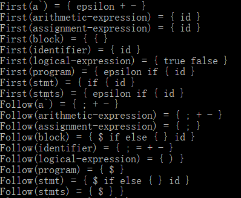
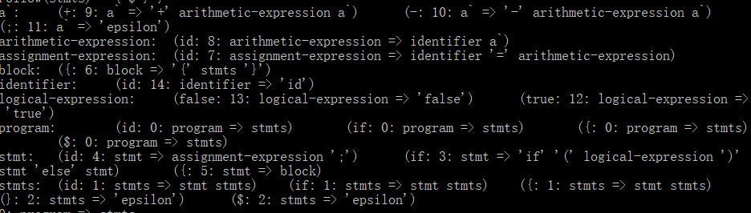
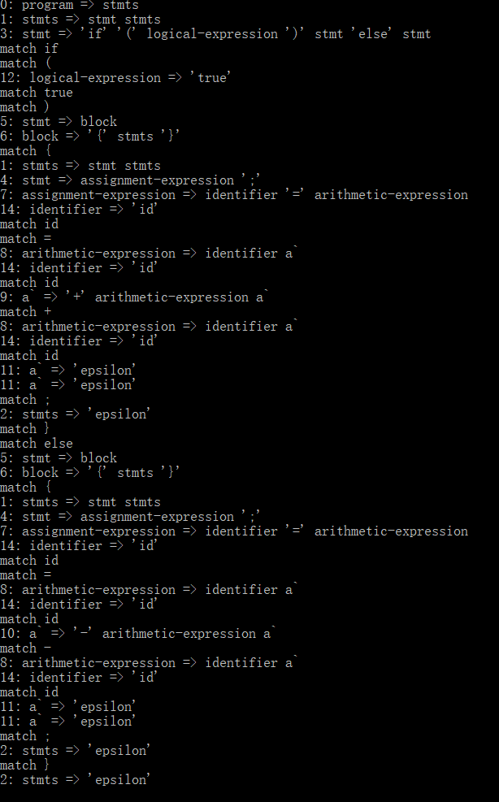
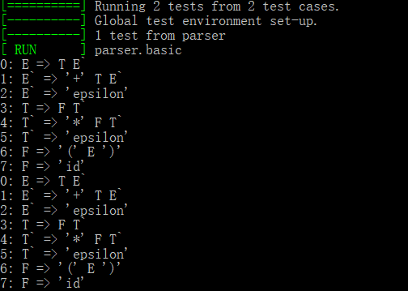
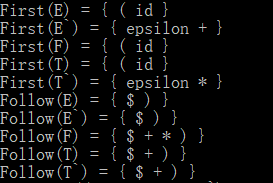
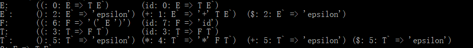
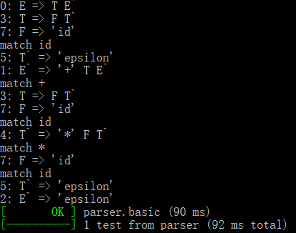
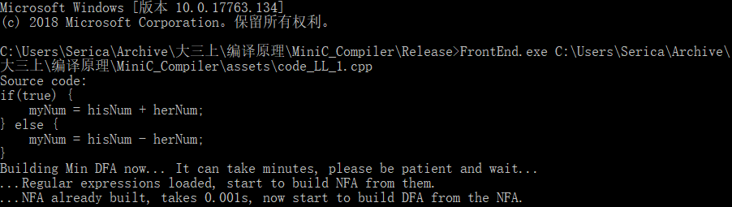

# 编译原理—语法分析器实验报告

<h3>09016414 罗崟洪</h3>

## 实验目的

根据编译原理课程知识，编写一个LL(1)语法分析器，以此深入理解语法分析的规则。

## 实验内容

选择某个语言的一个子集（与词法分析相同），将其语法用BNF范式表示（从语言的标准从剪裁）。

用LL(1)方法，消除文法的二义性、消除左递归、提取公共左因子、构建分析表，之后写出语法分析程序。

用该语言写出若干程序作为测试用例，用LL(1)分析程序对这些测试用例进行语法分析，生成语法树。检查相应的语法树是否正确。

## 实验假设

参考C99规范，我们选取了如下的语法规则：

```c++
program ::= stmts

stmts ::= stmts stmt | stmt

stmt ::= "if" "(" logical-expression ")" stmt "else" stmt 
		| assignment-expression
		| block
		
assignment-expression ::= identifier "=" arithmetic-expression

arithmetic-expression ::= arithmetic-expression '+' arithmetic-expression 
						| arithmetic-expression '-' arithmetic-expression 
						| identifier

logical-expression ::= "true" 
    				| "false"

block ::= "{" stmts "}"

identifier : 'id'
```

这是一个包含左递归的文法，我们对其消除左递归并提取公因子如下：

```c++
program ::= stmts

stmts ::= stmt stmts`| stmt

stmts` ::= stmt stms` | 'epsilon'

stmt ::= "if" "(" logical-expression ")" stmt "else" stmt 
		| assignment-expression
		| block
		
assignment-expression ::= identifier "=" arithmetic-expression

arithmetic-expression ::= identifier a` | number a`
a` ::= '+' arithmetic-expression a` 
		| '-' arithmetic-expression a` 
		| 'epsilon'

logical-expression ::= "true" 
    				| "false"

block ::= "{" stmts "}"

identifier : 'id'

number : 'num'"
```

我们的语法分析器讲用上述预处理后的文法，考虑到LL(1)文法识别能力较弱，且需要大量预处理工作，因此我们只选用了简单的文法。

## 算法实现

对于消除左递归和提取左公因子的部分并未用程序实现，考虑到FIRST和FOLLOW在以后的课程设计中会用到，因此用程序实现。

### FIRST

#### FIRST(X)

不断应用以下规则，直到没有新的终结符号或ε可以加入到任何FIRST集合中：

1. 如果$X$是终结符，则$FIRST(X)=X$。
2. 如果$X$是非终结符，$X→Y_1Y_2…Y_k$是产生式，$k \ge 1$，那么如果对于某个$i$，$a$在$FIRST(Y_i)$中且$\epsilon$在所有的$FIRST(Y_1)$、$FIRST(Y_2)$、$...$ 、$FIRST(Y_{i-1})$中，就把$a$加入$FIRST(X)$中。
3. 如果$X→\epsilon$是一个产生式，那么把$\epsilon$加入$FIRST(X)$中。

```c++
// Parser.cpp
set<int> Parser::first(int X)
{
	auto found = first_map.find(X);
	if (found != first_map.end())
		return found->second;
	set<int> first_X;
	// X是终结符，则FIRST(X)={X}
	if (is_vt(X)) {
		first_X.insert(X);
	}
	else {
		// 对所有X为产生式头部的产生式进行操作		
		for(auto it = vn_production_map[X].begin(), end = vn_production_map[X].end();
			it != end; ++it) {
			Production* prod = &productions[*it];
			//if (prod->head == X) {
			assert(prod->head == X);
				// 对产生式体中所有符号进行操作
				if (prod->body[0] == X) // 如果是空产生式或左递归则不考虑该产生式
					continue;

				int s_end = prod->body.back();

				for (int s : prod->body) {
					if (is_vt(s)) {
						// X -> s... 无须再考虑后续
						first_X.insert(s);
						break;
					}
					else if (s == EPSILON) {
						first_X.insert(EPSILON);
						assert(s == prod->body[0]); 
                        // 如果是空产生式只可以是X->epsilon的形式
					}
					else {
						// X -> A...
						set<int> first_A = first(s);
						if (first_A.count(EPSILON) == 0) {
							// A是非终结符且不会产生空串，则加入FIRST(A)就break
							first_X.insert(first_A.begin(), first_A.end());
							break;
						}
						else {
							// A是非终结符且会产生空串，则把FIRST(A)-{epsilon}加入FIRST(X)
							first_A.erase(find(first_A.begin(), first_A.end(), EPSILON));
							first_X.insert(first_A.begin(), first_A.end());
							if (s == s_end) {
								// X->A1...An中 A1..An都会产生空串则加入epsilon
								assert(first_X.count(EPSILON) == 0);
								first_X.insert(EPSILON);
							}
						}
					}
				}
			//}
		}
	}
	first_map[X] = first_X;
	return first_X;
}
```

#### FIRST(α)

对于串$\alpha = X_1X_2...X_n$，如下计算$FIRST(\alpha)$：

首先加入$FIRST(X_1)-\{\epsilon\}$，如果$\epsilon \in FIRST(X_1)$那么再加入$FIRST(X_2)-\{\epsilon\}$，以此类推。若对于所有的$i$，有$\epsilon \in FIRST(X_i)$则把$\epsilon$加入$FIRST(\alpha)$中。

```c++
// Parser.cpp
set<int> Parser::first(vector<int>& beta)
{
	set<int> first_beta;
	// 传入了空产生式
	if (beta[0] == EPSILON) {
		first_beta.insert(EPSILON);
		return first_beta;
	}

	for (auto s = beta.begin(), s_end = beta.end(); s != s_end; ++s) {
		set<int> first_s = first(*s);
		if (first_s.count(EPSILON) == 0) {
			first_beta.insert(first_s.begin(), first_s.end());
			break;
		}
		else {
			// s产生空串 FIRST_BETA = FIRST_BETA ∪ FIRST_S - { epsilon }
			first_s.erase(find(first_s.begin(), first_s.end(), EPSILON));
			first_beta.insert(first_s.begin(), first_s.end());
			if (s + 1 == s_end) {
				assert(first_beta.count(EPSILON) == 0);
				first_beta.insert(EPSILON);
			}
		}
	}
	return first_beta;
}
```

### FOLLOW

不断应用以下规则，直到没有新的终结符号可以加入到任何FOLLOW集合中：

1. 将$\$$加入$FOLLOW(S)$中，其中$S$是开始符号，而$\$$是输入右侧的结束标记。
2. 如果存在产生式$A→\alpha B\beta$，那么$FOLLOW(B)$加入$FIRST(\beta)-{\epsilon}$。
3. 如果存在产生式$A→\alpha B$或存在产生式$A→\alpha B\beta$且$\epsilon \in FIRST(\beta)$，那么$FOLLOW(B)$加入$FOLLOW(A)$。

```c++
// Parser.cpp
set<int> Parser::follow(int X)
{
	auto found = follow_map.find(X);
	if (found != follow_map.end())
		return found->second;
	else
		follow_map[X] = set<int>();

	// $加入FOLLOW(S)，其中$是开始符号，$是右端的结束标记	
	set<int> follow_X;
	if (X == productions[0].head) {
		follow_X.insert(DOLLAR);
	}
	// 遍历所有形如 A->aX，A->aXb的式子
	for (auto prod = productions.begin(), prod_end = productions.end(); prod != prod_end; ++prod) {
		for (auto s = prod->body.begin(), s_end = prod->body.end(); s != s_end; ++s) {
			if (X == *s) {
				auto next = s;
				++next;
				if (next == s_end) {
					// A->aX
					
					set<int> follow_A = follow(prod->head);
					follow_X.insert(follow_A.begin(), follow_A.end());
				}
				else {
					// A->aXb
					vector<int> beta(next, s_end);
					set<int> first_beta = first(beta);
					if (first_beta.count(EPSILON) == 0) {
						follow_X.insert(first_beta.begin(), first_beta.end());
					}
					else {
						// b =*=> epsilon
						first_beta.erase(find(first_beta.begin(), first_beta.end(), EPSILON));
						follow_X.insert(first_beta.begin(), first_beta.end());
						set<int> follow_A = follow(prod->head);
						follow_X.insert(follow_A.begin(), follow_A.end());
					}
					break;
				}
			}

		}
	}
	follow_map[X] = follow_X;
	return follow_X;
}
```

### 构造LL(1)预测分析表

对于文法$G$的每个产生式$A→α$：

1. 对于$FIRST(\alpha)$中每个终结符号$a$，将$A→\alpha$加入$M[A, a]$。
2. 如果$\epsilon$在$FIRST(\alpha)$中，那么对于$FOLLOW(A)$中的每个终结符号$b$，将$A→\alpha$加入$M[A, b]$中。
3. 如果$\epsilon$在$FIRST(\alpha)$中，且$\$$在$FOLLOW(A)$中，那么将$A→\alpha$加入$M[A, \$]$中。

**从下面的代码中可以看到，在具体实现时，如果不是LL(1)文法，会打印报错信息。**

```c++
// Parser.cpp
void Parser::build_LL_1_parsing_table()
{
	for (auto prod = productions.begin(), prod_end = productions.end(); prod != prod_end; ++prod) {
		// 对于文法G的每个产生式A->alpha
		set<int> first_alpha = first(prod->body);

		for (auto s = first_alpha.begin(), s_end = first_alpha.end(); s != s_end; ++s) {
			// 对于FIRST(alpha)中的每个终结符号a，把A->alpha加入M[A, a]中
			if (is_vt(*s)) {
				if (M.count(pair<int, int>(prod->head, *s)) == 0)
					M[pair<int, int>(prod->head, *s)] = prod->index;
				else {
					cout << "WARNING: The grammar is not LL(1)!";
					break;
				}
			}
		}
		// 如果epsilon在FIRST(alpha)中，那么对于FOLLOW(A)中的每个终结符号b，将A->alpha加入到M[A,b]中
		// 如果epsilon在FIRST(alpha)中，且$在FOLLOW(A)中，将A->alpha加入M[A, $]中
		if (first_alpha.count(EPSILON) == 1) {
			set<int> follow_A = follow(prod->head);
			for (auto s = follow_A.begin(), s_end = follow_A.end(); s != s_end; ++s) {
				if (is_vt(*s)) {
					if (M.count(pair<int, int>(prod->head, *s)) == 0)
						M[pair<int, int>(prod->head, *s)] = prod->index;
					else {
						cout << "WARNING: The grammar is not LL(1)!";
						break;
					}
				}
			}
			if (follow_A.count(DOLLAR) == 1) {
				if (M.count(pair<int, int>(prod->head, DOLLAR)) == 0)
					M[pair<int, int>(prod->head, DOLLAR)] = prod->index;
				else {
                    // 不是LL(1)文法
					cout << "WARNING: The grammar is not LL(1)!";
					break;
				}
			}
		}
	}
}
```

##  LL(1)分析表

根据上述算法可以构造预测实验假设中文法的LL(1)分析表。由于产生式较长，故不用表格形式给出，而是用（终结符-产生式）对给出，这种形式适合表示稀疏矩阵。

### FIRST

First(a\`) = { epsilon + - }

First(arithmetic-expression) = { id }

First(assignment-expression) = { id }

First(block) = { { }

First(identifier) = { id }

First(logical-expression) = { true false }

First(program) = { epsilon if { id }

First(stmt) = { if { id }

First(stmts) = { epsilon if { id }

### FOLLOW

Follow(a\`) = { ; + - }

Follow(arithmetic-expression) = { ; + - }

Follow(assignment-expression) = { ; }

Follow(block) = { \$ if else { } id }

Follow(identifier) = { ; = + - }

Follow(logical-expression) = { ) }

Follow(program) = { \$ }

Follow(stmt) = { \$ if else { } id }

Follow(stmts) = { \$ } }

### 预测分析表

黑体字为非终结符，之后为（终结符：产生式）对，相当于预测分析表中的表项。没有出现的即为空项。

**a\`:**     (+: a\` => '+' arithmetic-expression a\`)      (-:  a\` => '-' arithmetic-expression a\`)     (;: a\` => 'epsilon')
arithmetic-expression:  (id: arithmetic-expression => identifier a`)

assignment-expression:  (id: assignment-expression => identifier '=' arithmetic-expression)

**block:**  ({: block => '{' stmts '}')

**identifier:**     (id: identifier => 'id')

**logical-expression:**     (false: logical-expression => 'false')      (true: logical-expression => 'true')

**program:**        (id: program => stmts)       (if: program => stmts)       ({: program => stmts)        (\$: program => stmts)

**stmt:**   (id: stmt => assignment-expression ';')      (if: stmt => 'if' '(' logical-expression ')' stmt 'else' stmt)       ({: stmt => block)

**stmts:**  (id: stmts => stmt stmts)    (if: stmts => stmt stmts)    ({: stmts => stmt stmts)     (}: stmts => 'epsilon')      ($: stmts => 'epsilon')

## 表驱动的预测语法分析

对于词法分析器输出的Token序列w，根据预测分析表M输出最左推导。下面的代码实现了龙书p144的算法。

```c++
// Parser.cpp
void Parser::parse_by_LL_1(vector<Token>& w)
{
	Token end("$", "$", 0, 0, 0);
	w.push_back(end);
	stack<string> s;
	s.push("$");
	s.push(symbols[0]);
	auto ip = w.begin();
	string X = s.top();
	while (X != "$") {
		// 如果X是终结符且和ip所指的符号相同则出栈
		if (X == ip->name) {
			cout << "match " << s.top() << endl;
			s.pop();
			++ip;
		}
		// 如果X是终结符却和ip所指符号不同，报错
		else if (is_vt(X)) {
			cout << "error\n";
			break;
		}
		// 如果M[X, a]是报错条目
		else if ((ip->name != "$" && M.count(pair<int, int>(vn_map[X], vt_map[ip->name])) == 0) ||
			(ip->name == "$" && M.count(pair<int, int>(vn_map[X], DOLLAR)) == 0)) {
			cout << "error\n";
			break;
		}
		else {
			unsigned int prod_index;
			if (ip->name == "$")
				prod_index = M[pair<int, int>(vn_map[X], DOLLAR)];
			else
				prod_index = M[pair<int, int>(vn_map[X], vt_map[ip->name])];
			print_production(prod_index);
			cout << endl;
			s.pop();
			Production p = productions[prod_index];
			for (int i = p.body.size() - 1; i >= 0; --i) {
				if (p.body[i] != EPSILON) // 如果不是空产生式才入栈
					s.push(symbols[p.body[i]]);
			}
		}
		X = s.top();
	}
}
```

## 构成编译器前端

我们可以把词法分析器实验中的成果拿过来运用，构成编译器的前端。当然，该编译器目前只能输出语法树（即最左推导序列）。下面是部分代码，注意`//...`意味着有代码省略。

```c++
// ...
int main(int argc, char* argv[])
{
	// ...
    lexer.run(code); // 词法分析
	vector<Token> tokens = lexer.get_tokens(); // 获得词法分析结果
	Parser parser;
    // ...
	parser.parse_by_LL_1(tokens); // 语法分析
    return 0;
}
```

## 测试

### 测试样例

首先我们根据实验假设中的语法写一段简单的代码作为测试用例：

```c++
if(true) {
    myNum = hisNum + herNum;
} else {
    myNum = hisNum - herNum;
}
```

计算的FIRST和FOLLOW：



预测分析表：



最左推导序列，容易证明其正确性：



### 测试龙书中的例子

我们使用了书上消除左递归后的文法(4.28)测试，其产生式如下：



计算的FIRST和FOLLOW集合如下，可见和书上答案是一样的。



构造的预测分析表如下，可见和书中结果一样。



生成的最左推导序列，这也和书上的一样：



## 如何执行我们的Parser程序

和Lexer一样，需要传入一个参数，即测试样例（我们用的测试样例同样在`test_case`文件夹中），注意到我们这次程序命名为`FrontEnd.exe`而非`Parser.exe`，因为它还集成了词法分析器。

```bash
FrontEnd.exe <path-to-code>
```



## Future Work

我们实现的语法分析器也大量使用了`set`和`map`等数据结构以便于编程以及加速计算，且建立了许多`map`映射，如`vn_production_map`用于寻找非终结符`vn`的所有产生式。但目前类中成员直接耦合较为严重，且建立语法分析器过程复杂，因此还需要考虑重构。

当然，未来还需要加入LALR分析以及对yacc的`.y`配置文件的支持。